## How to analyse an algorithm	[Back](./../AlgorithmnMenu.md)

### 1. Overview

Main **thoughts** of designing algorithms:

- [**DC**](./DC/DC.md)
- [**DP**](./DP/DP.md)
- [**Greedy**](./Greedy/Greedy.md)
- [**Search**](./Search/Search.md)
- [**Random**](./Random/Random.md)

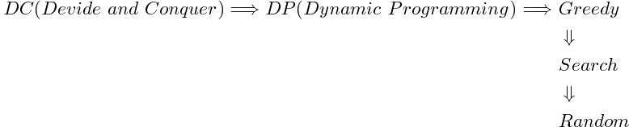

Sometimes, the **performance** of an algorithm matters so much, when the size of a problem **n** is so big.

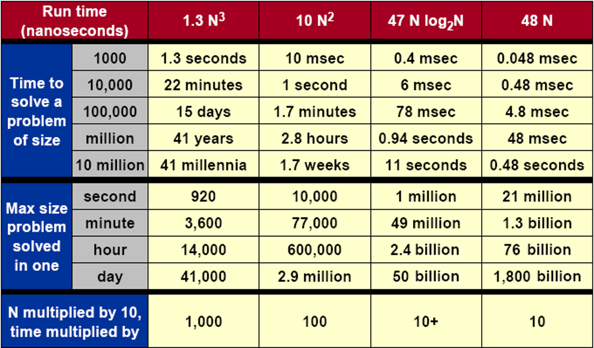

But it's not always true for high performance, when an algorithm depends on what is more important like the following items:

- modularity(模塊性)
- correctness(正確性)
- maintainability(可維護性)
- functionality(功能性)
- robustness(健壯性)
- user-friendliness(用戶友好性)
- programmer time(編程效率)
- simplicity(簡潔度)
- extensibility(可擴展性)
- reliability(可靠度)

There are **three** kinds of analysis:

- Worst-case(考慮該類問題的最優解, 關注最壞情況下的最好情況)
- Average-case
- Best-case(虛假的)

There are **three** notations of **time**

- ***θ*** (drop **low-order** terms, and ignore **leading** constants)

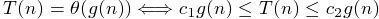

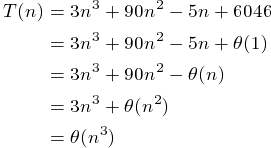

- ***Ω***

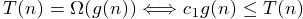

- ***O***

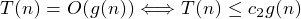

### 2. Recursive Algorithm

- Substitution: 猜想 (通常通過畫Recursive Tree來給出猜想) 並證明
	- guess
	- verify

		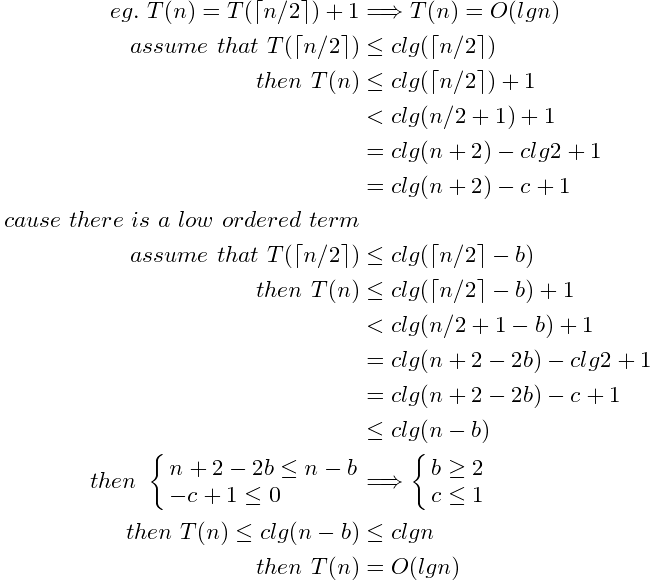
		=====
		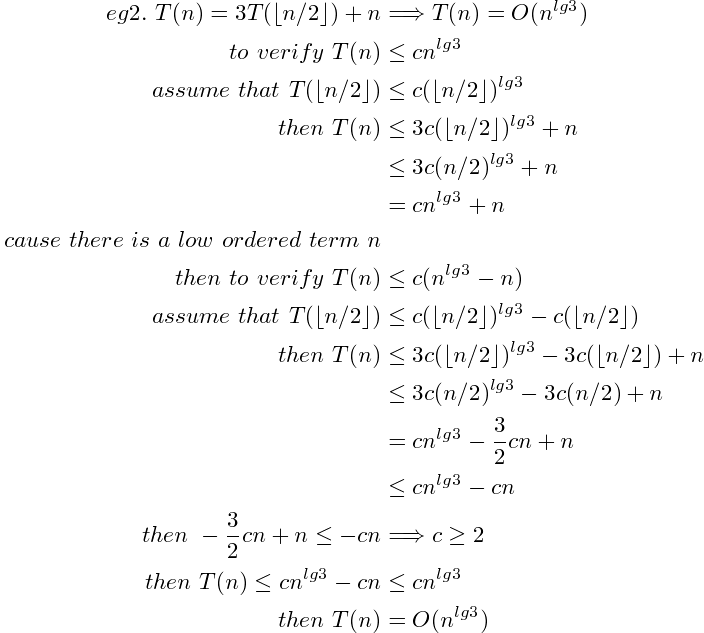
	- solve
- Recursive Tree: 通過畫出遞歸樹來求解開銷

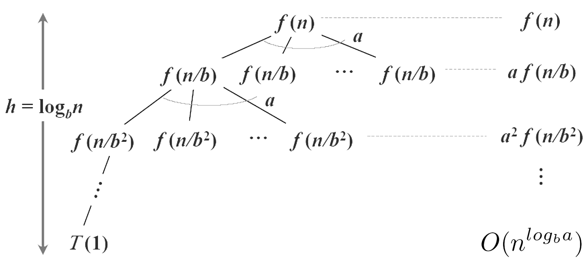

- Master:

	
	
	- 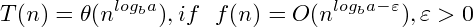

	- 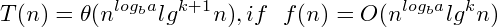

	- 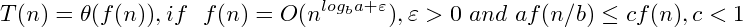
