## Assembly-line Scheduling Problem(裝配線調度)	[Back](./../DP.md)

### Overview
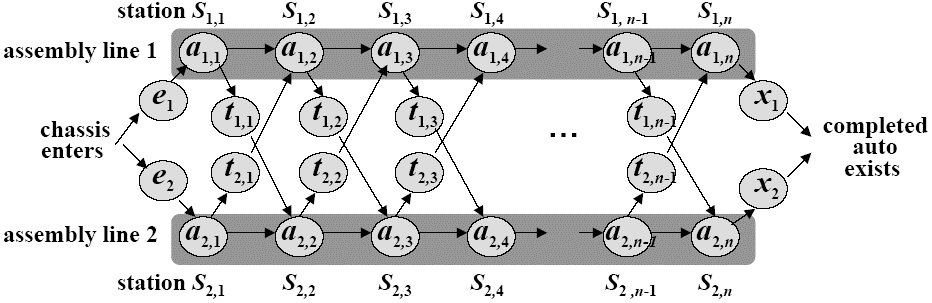

- 求出最短裝配時間
- : 第i條線, 第j個站所花時間
- 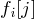: 第i條線, 到第j個站的最短時間
- 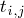: 從第i条线到另一條線的j+1站所花的時間
- 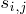: 第i條線, 第j個站它的前一個站應該是第几條裝配線

### Optimal Substructure
- 當我們知道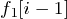和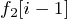是最優的時候, 那麼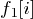一定是在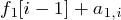和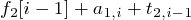之間取最小的值.

### Recursive Expression
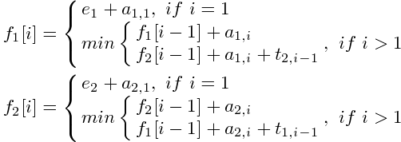

### Solution
- 最優解: 通過反向遍曆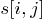, 找到最優解.
- 最優解的值: 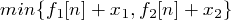
