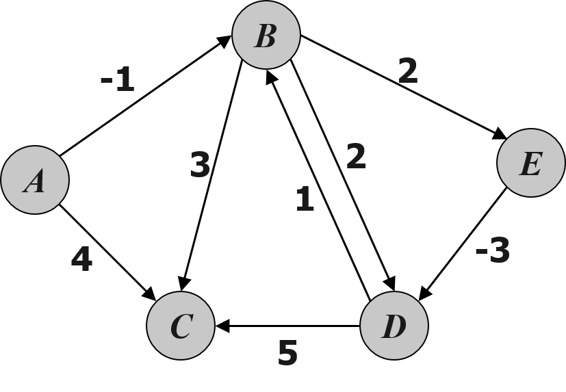
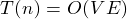
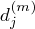
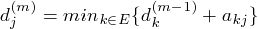
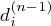

## Bellman-Ford Algorithmn for Single-source Shortest Path Problem	[Back](./../DP.md)

### Overview

- 單源點最短路徑問題中路徑存在負值的情況, 不能使用貪心策略的[**Dijkstra**]()算法, 而要使用Bellman-Ford.
- Dijkstra算法每次都會選出離源節點最短的節點, 然後鬆弛其他節點.
- Bellman-Ford是在Dijkstra的基礎上鬆弛所有的節點**V-1**次, 第**V**次若能鬆弛, 則該圖存在負循環, 返回錯誤. 
- 鬆弛指若存在更短的路徑, 則更新為該更短的路徑.
- 時間複雜度: 
- : 表示源節點到第j個節點中間最多經過m條邊的情況下, 最短路徑的值.
- : 表示從第i個節點到第j個節點的路徑權值.

### Recursive Expression
- 

### Solution
- 

