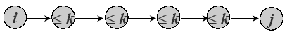
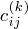
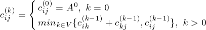
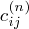

## Floyd-Warshall Algorithmn for All-pairs Shortest Path Problem	[Back](./../DP.md)

### Overview

- All-pairs Shortest Path Problem在所有邊均是非負權值情況下, 若使用Dijkstra算法, 則時間複雜度則為
- All-pairs Shortest Path Problem在有負權值的邊情況下, 若使用Bellma-Ford算法, 則時間複雜度則為
- 約束條件: 節點間最多能過多少個節點
- 時間複雜度: 
- : 表示第i個節點到第j個節點在最多能過k個節點的情況下, 最短的路徑值.

### Recursive Expression
- 

### Solution
- 
