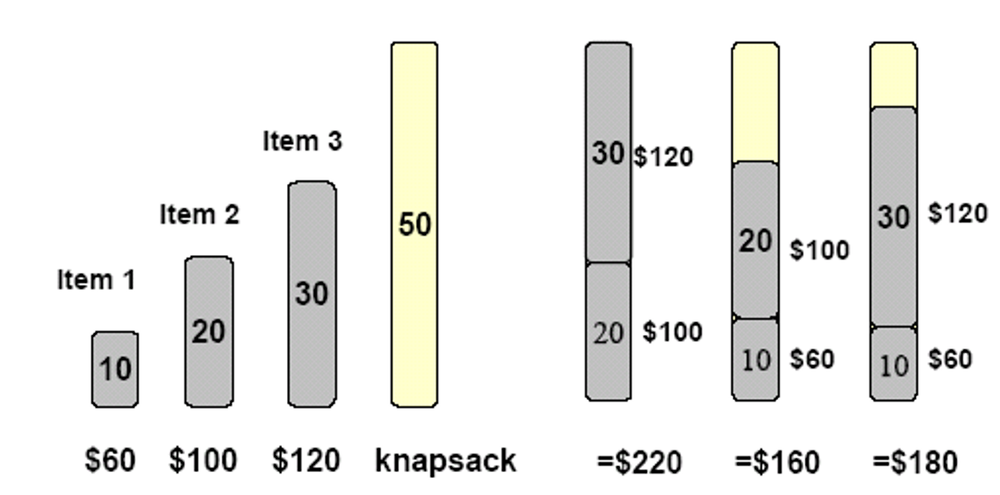
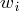
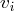
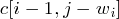
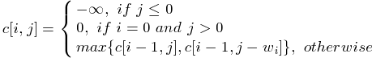
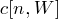

## 0-1 Knapsack Problem(0-1背包)	[Back](./../DP.md)

### Overview

- 每個item只能取值0或1, 求如何存放背包才能獲取利益最大值
- : 用容量j去裝i個items, 最多能裝多少個
- : 第i個item的重量
- : 第i個item的價值

### Optimal Substructure
- 當我們求時, 若不取第i個item, 則必定等於;而若取, 則的值為加上該item的價值.

### Recursive Expression

	

### Solution
- 最優解的值: 
