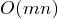
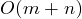
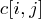
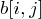
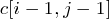
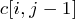
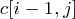
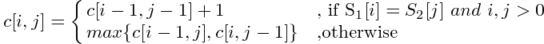
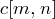

## Longest Common Sub-sequence Problem(最長公共子序列)	[Back](./../DP.md)

### Overview

- 求出最短裝配時間
- 主程序的時間複雜度: 
- 追溯最優解的時間複雜度: 
- : S1序列取前i個, S2序列取前j個時的最長公共子序列長度值. (用於求最優解的值)
- : S1序列取前i個, S2序列取前j個時, 是如何求得. (用於求最優解)

### Optimal Substructure
- 當我們知道若求的時候, 若S1序列的最後一個字符與S2的最後一個字符相同, 則該字符一定在公共子序列中, 因此的值必定是的值加一; 否則, 的值將是和中較大的一個.

### Recursive Expression

	

### Solution
- 最優解: 通過反向遍曆, 找到最優解.
- 最優解的值: 
