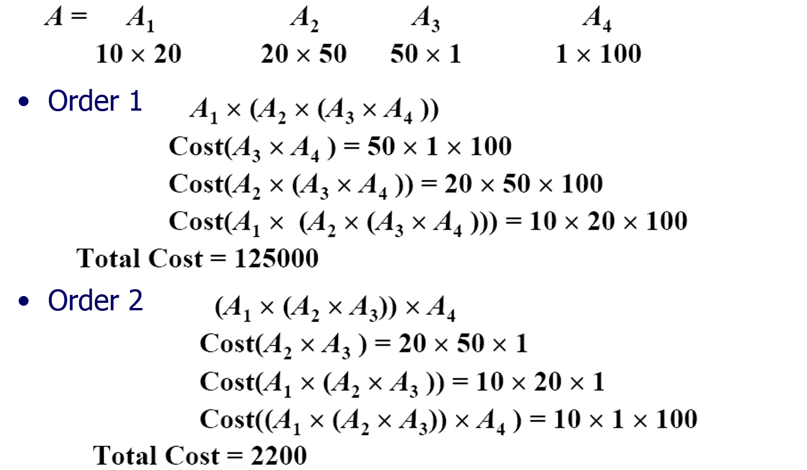
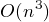
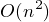
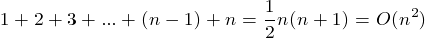
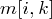
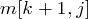
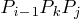
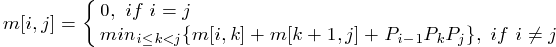
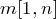

## Matrix-chain Multiplication Problem(矩陣鏈相乘)	[Back](./../DP.md)

### Overview

- 求出乘次數最少的順序
- 主程序時間複雜度: 
- 添加括號時間複雜度: 
- 子問題個數(m數組的填寫): 
- : 第i個矩陣到第j個矩陣次數的最少值 (用於記錄最優解的值)
- : 第i個矩陣到第j個矩陣相乘時, 應該先乘前個 (用於記錄最優解)
- : 第i個矩陣的兩個維數

### Optimal Substructure
- 當我們知道和都是所乘次數最少的, 那麼的值一定是這兩個值相加後, 再加上.

### Recursive Expression

### Solution
- 最優解: 通過反向遍曆, 找到最優解.
- 最優解的值: 
