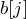
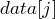
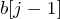
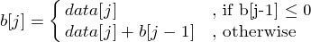
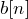

## Max Sum Problem(最大和)	[Back](./../DP.md)

### Overview

- 求出某一段最大和
- : 以第j個結尾的最大和的值.

### Optimal Substructure
- 當我們求時, 若的值為非正, 則肯定沒意義; 若的值為正, 且為非正, 則肯定為; 而若的值為正, 且也為正, 則肯定為加上.

### Recursive Expression

	

### Solution
- 最優解: 通過求解時指針指向i和j來找到最優解.
- 最優解的值: 
