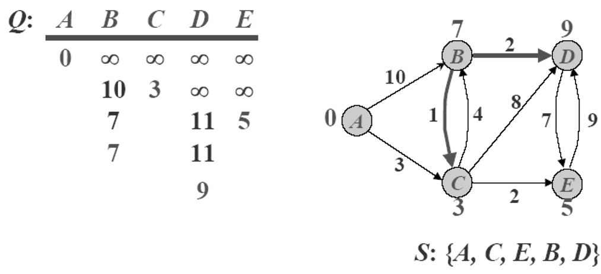
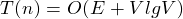

## Dijkstra Algorithmn for Single-source Shortest Path Problem(分數)	[Back](./../Greedy.md)

### Overview

- Dijkstra算法與[**Bellman-Ford**](./../../DP/Bellman/Bellman.md)算法不同, 其只適用於求解只有非負權值邊的圖.
- 時間複雜度: 

### Greedy Solution
- 根據S集合的節點來鬆弛非S集合的節點
- 每次選擇該趟中最小路徑值的非S集合節點並把其加入到S集合
