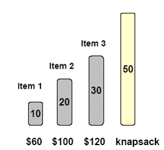

## Fractional Knapsack Problem(分數)	[Back](./../Greedy.md)

### Overview

- 與[**0-1 Knapsack**](./../../DP/Knapsack/Knapsack.md)不同的是, 分數背包可以分割地取一個物品, 而非要不取, 要不不取.

### Greedy Solution
- 每次選擇**value/weight**最大的物品放入包裏直到無法完全放入, 最後分割物品填滿包則會得到最優解
- 上面情況的最優解: 取item1 10, item2 20 和 item3 20則會得到最大價值240.
