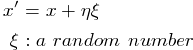
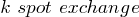

## Random(隨機)	[Back](./../Analysis.md)

### Overview
- 由於現實中我們有許多我們無法高效得到某一問題的最優解, 往往我們會通過**隨機**的思想, 在海量的窮舉之中找到**近似的最優解**, 而這種隨機是通過一定的規則去選取的.
- 優化問題:
	- 函數優化: 分量連續 
	- 組合優化: 分量離散 

- 領域函數: 只從一個解集到另一個解集的隨機映射關係
- 局部極小: 是一種利用貪心和领域函数去尋找更優解的思想

### 典型問題及算法
- **Genetic Algorithm**
- **Simulated Annealing Algorithm**
