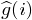
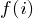
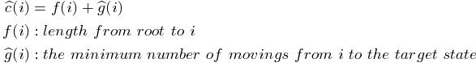

## 15-Puzzle Problem(15智力問題)	[Back](./../Search.md)

### Overview

- 給定**4*4**的矩陣, 每次只能移動有空位的方塊, 直到該矩陣變圖中的 **Target arrange**.

### Search Solution
- 為了找出可行解, 我們使用一種比窮舉要好但並不高效的算法 (**分支-限界**).
- 類似**BFS Algorithmn** (廣度優先搜索)
- 每次遍曆**Alive-node**, 便會生成與其連接的所有子節點

#### State_tree of BF-Search

- 當遍曆到可行解時便停止遍曆

#### State_tree of LC-Search
- 存在一種更智能的搜索**LC-Search**
- 生成孩子節點時會給其計算出一個權值, 然後遍曆現存**E-node**中權值最大的節點(該節點變成**Alive-node**)
- 的值往往隨著遍曆的深度的增大而減少

