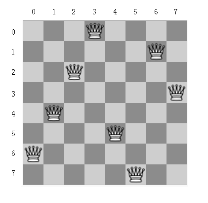
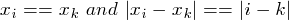
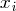

## N-Queen Problem(N皇后問題)	[Back](./../Search.md)

### Overview
#### n = 8

- 給定**8*8**的棋盤, 放置8個皇后且這些皇后不能在同一直線或斜線上.
- 限界條件: 判斷某節點的所有孩子是否符合的條件. 
- : 表示第i行放第几列.

### Search Solution
- 為了找出可行解, 我們使用一種比窮舉要好但並不高效的算法 (**回溯**).
- 類似**DFS Algorithmn** (深度優先搜索)

#### State_tree

- 當**活節點**不符合**限界條件**時, 則把其變成**死節點**
- **回溯**過程就是當遍曆所有子節點後, 回溯到父親節點的兄弟節點繼續遍曆
- 當訪問到某葉子節點則表示有一可行解
