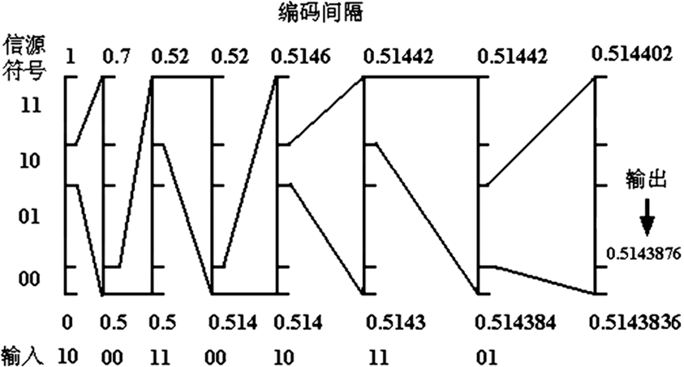

## Arithmetic Coding	[Back](./../Encode.md)

### Arithmetic Coding
- Arithmetic編碼: 是一種比Huffman編碼還要有效的現代編碼
- 浮點數精度需要考慮
- 用比例縮放來解決溢出問題
- 廣泛應用於圖像數據編碼



#### 數據結構
```cpp
weight[4];	//weight[0] for "00", weight[1] for "01"
			//weight[2] for "10", weight[3] for "11"
```

####算法實現

```cpp
/* Code */
long double ARITHMETIC_CODING(char* input)
{
	long double start = 0;
	long double end = 1;
	char extract[3];
	if (strlen(input) % 2 != 0)
		return -1.0;
	else
	{
		char* ch = input;
		while (*ch != '\0')
		{
			extract[0] = *ch++;
			extract[1] = *ch++;
			extract[2] = '\0';
			char* extract_string = extract;
			if (!strcmp(extract_string, "11"))
			{
				start = end - (end - start) * weight[3];
			}
			else if (!strcmp(extract_string, "10"))
			{
				long double e = end - (end - start) * weight[3];
				long double s = end - (end - start) * (weight[3] + weight[2]);
				end = e;
				start = s;
			}
			else if (!strcmp(extract_string, "01"))
			{
				long double e = end - (end - start) * (weight[3] + weight[2]);
				long double s = start + (end - start) * (weight[0]);
				end = e;
				start = s;
			}
			else
			{	//"00"
				end = start + (end - start) * (weight[0]);
			}
			cout.precision(20);										//设置精度，防止损失
			printf("start: %.12lf, end: %.12lf\n", start, end);
		}
		return (start + end) / 2;
	}
}
```

