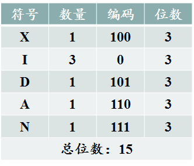
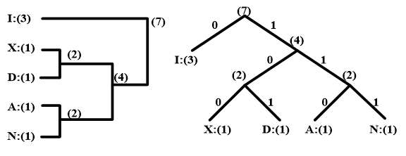

## Huffman Coding	[Back](./../Encode.md)

### Huffman Coding
- Huffman編碼: 為了解決字符因不同權值編碼時, 不能出現前綴碼問題

	```A: 00; B: 001;	//B出現前綴碼A```

- 字符權值表



- **Huffman樹**不唯一



- 需要事先知道字符權值, (**Adaptive Huffman Coding**解決這個問題)
- 廣泛應用於壓縮技術
- 採用**自底向上**的編碼方式

####數據結構	
```cpp
class coded_char
{
	private:
	char value;
	double weight;
	string code;
	bool iscoded = false;

	public:
	coded_char(char value, double weight) :value(value), weight(weight){}

	coded_char* left, *right;

	void setcode(string s){code = s;}
	string getcode(){return code;}
	double getweight(){return weight;}
	bool getiscoded(){return iscoded;}
	void setiscoded(){iscoded = true;}
	char getvalue(){return value;}
};
```

####算法實現
```cpp
/* Create a Hufman Tree */
void HUFFMAN_CODE_CREATE(coded_char* data[])
{
	for (int i = num; i < 2 * num - 1; i++)
	{
		coded_char* last = get_last(data, i);
		coded_char* second_last = get_second_last(data, last, i);
		data[i] = new coded_char(' ', (*last).getweight() + (*second_last).getweight());
		(*data[i]).left = last;
		(*data[i]).right = second_last;
		(*last).setiscoded();
		(*second_last).setiscoded();
	}

	(*data[2 * num - 2]).setcode("");	//root
}

/* Code */
void CODE(coded_char* root)
{
	if ((*root).getvalue() != ' ')
	{
		return;
	}
	else
	{
		(*((*root).left)).setcode((*root).getcode() + "0");
		(*((*root).right)).setcode((*root).getcode() + "1");
		trace((*root).left);
		trace((*root).right);
	}
}
```
