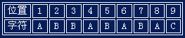
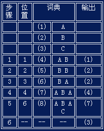

## LZW Coding	[Back](./../Encode.md)

### LZW Coding
- LZW編碼: 是一種基於字典的編碼技術
- 開始編碼時, 字典必須含有出現的所有單個字符
- 每次加進一個前綴和一個字符





####數據結構	
```cpp
class dictionary
{
private:
	int index;
	char value[MAXSIZE];
	int code;
public:
	dictionary(int index, char value[]) :index(index){ strcpy((*this).value, value); };
	char* get_value(){ return value; }
	int get_index(){ return index; }
	void set_code(int set){ code = set; }
	int get_code(){ return code; }
};
```

####算法實現
```cpp
/* Coding */
void LZW_CODING(const char* input)
{
	const char* ch = input;
	int count = 1;					//用于char指针跳转
	while (*(ch + 1) != '\0')
	{
		char a[MAXSIZE];
		bool isexisted = false;
		for (int i = 0; i < num; i++)
		{
			strncpy(a, ch, count + 1);
			a[count + 1] = '\0';

			if (!strcmp((*d[i]).get_value(),a))
			{
				isexisted = true;
				break;
			}
		}
		if (isexisted == false)
		{
			char b[MAXSIZE];
			strncpy(b, ch, count);
			b[count] = '\0';
			for (int i = 0; i < num; i++)
			{
				if (!strcmp((*d[i]).get_value(), b))
				{
					d[num++] = new dictionary(num + 1, a);
					(*d[num - 1]).set_code((*d[i]).get_index());
					break;
				}
			}
			ch += count;
			count = 1;
		}
		else
		{
			count++;
		}
	}

	for (int i = 0; i < num; i++)
	{
		if ((*((*d[i]).get_value()) == extract_last((*d[num - 1]).get_value())))
		{
			d[num++] = new dictionary(num + 1, "");
			(*d[num - 1]).set_code((*d[i]).get_index());
			break;
		}
	}

	cout << "EnCode: ";
	for (int i = _count; i < num; i++)
		cout << (*d[i]).get_code();
	cout << endl;
}

/* Initialize */
void INITIALIZE_DICTIONARY(const char* input)
{
	const char* ch = input;
	
	while (*ch != '\0')
	{
		bool isexisted = false;
		for (int i = 0; i < num; i++)
		{
			if (*(*d[i]).get_value() == *ch)
				isexisted = true;
		}
		if (isexisted == false)
		{
			char a[MAXSIZE];
			strncpy(a, ch, 1);
			a[1] = '\0';
			d[num++] = new dictionary(num + 1, a);
		}
		ch++;
	}
}
```
