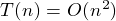

##Bubble Sort [Back](./../Sort.md)
- 冒泡排序 :每趟都把最大的沉到后。
- 时间复杂度：
	-  (最壞平均情況) 
	-  (最好情況)
- 空間複雜度：
- 稳定性 :稳定
- 适用情况 :数据少, 初始序列基本有序


```c
void BUBBLE_SORT(int num[], int size)
{
	for (int i = 0; i < size; i++)
	{
		for (int j = 0; j < size - i; j++)
		{
			if (num[j] > num[j + 1])
			{
				int temp = num[j];
				nun[j] = num[j + 1];
				num[j + 1] = temp;
			}
		}
	}
}
```
