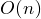
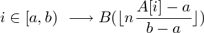

##Bucket Sort [Back](./../Sort.md)
- 桶排序: 把所有數分成若干區間, 並為每個區間建立鏈表. 把所有數分別加入對應區間, 並對所有鏈進行穩定排序
- 时间复杂度:  (最好,平均,最壞情況)
- 空間複雜度: /
- 稳定性: 稳定
- 适用情况: 數的分佈均勻
- 散列過程: 

```c
/* [0,1) */
void BUCKETSORT(int A[], int array_size)
{
	int n = array_size;
	for (int i = 1; i <= n; i++)
		//insert_list(B[n*A[i]], A[i]);
	for (int i = 0; i <= n - 1; i++)
		INSERTIONSORT(B[i], B[i].array_size);
}
```
