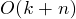

##Count Sort [Back](./../Sort.md)
- 計數排序: 計算某元素前有k個小於它的元素, 則該元素放在第k+1位
- 时间复杂度:  (最好,平均,最壞情況)
- 空間複雜度: /
- 稳定性: 稳定
- 适用情况: 小範圍整數, 且範圍不超過個數的量級

```c
/* A[] to store data, B[] to store sorted data */
void COUNTSORT(int A[], int B[], int k, int array_size)
{
	int C[MAXSIZE];
	for (int i = 0; i <= k; i++)
		C[i] = 0;
	for (int j = 0; j <= array_size - 1; j++)
		C[A[j]]++;
	for (int i = 1; i <= k; i++)
		C[i] = C[i] + C[i - 1];
	
	for (int j = array_size - 1; j >= 0; j--)
	{
		B[C[A[j]] - 1] = A[j];
		C[A[j]]--;
	}
}
```
