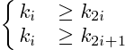
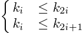
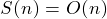
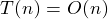
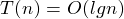
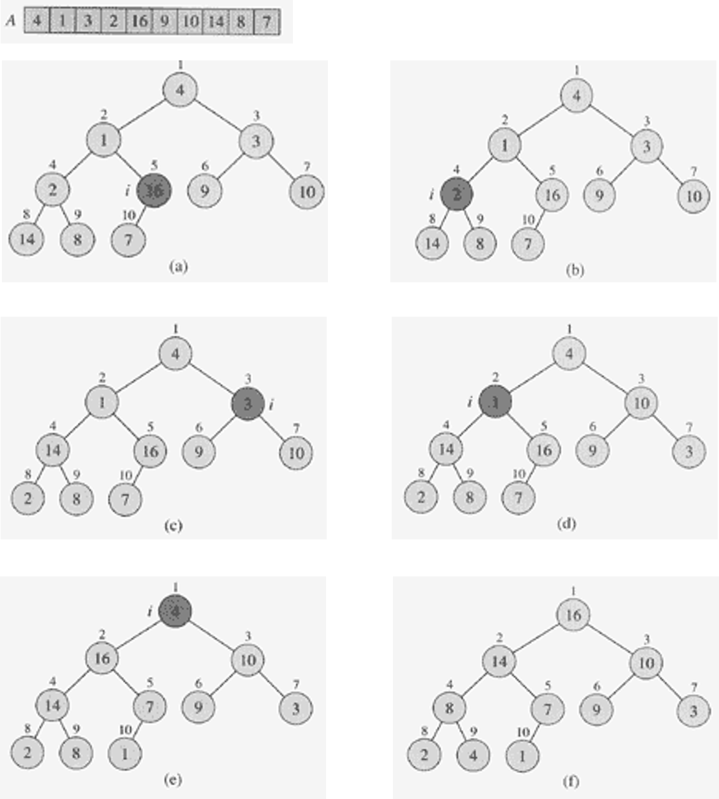
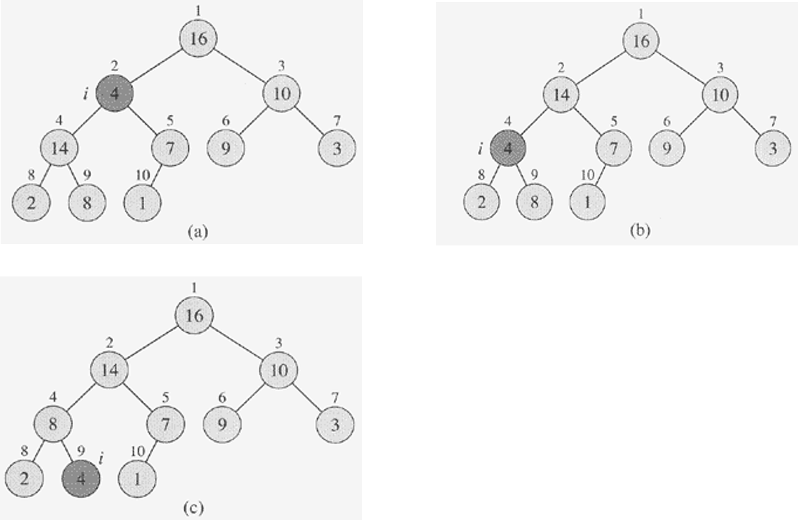
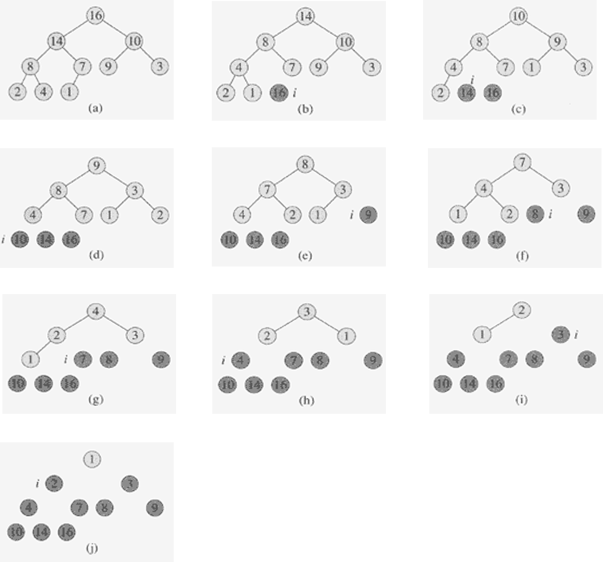

##Heap Sort [Back](./../Sort.md)
### Overview
- 堆排序: 利用大頂堆或小頂堆的特性, 每趟取出樹根結點並調整堆, 直到所有數被取出.
	- 大頂堆: 
	- 小頂堆: 
- 时间复杂度:  (最好,平均,最壞情況)
- 空間複雜度: 
- 稳定性: 不稳定
- 适用情况: 實時應用, 快速取出最大或最小值
- **BUILD_MAX_HEAP:**  
- **MAX_HEAPIFY:** 

### Example
##### 1. BUILD_MAX_HEAP


##### 2. MAX_HEAPIFY


##### 3. HEAP_SORT


### Code
```c
void MAX_HEAPIFY(int A[], int heap_size, int i)
{
	int largest;
	int l = LEFT(i);
	int r = RIGHT(i);
	if (l < heap_size && A[l] > A[i])
		largest = l;
	else
		largest = i;

	if (r < heap_size && A[r] > A[largest])
		largest = r;
	if (largest != i)
	{
		exchange(A, i, largest);
		MAX_HEAPIFY(A, heap_size, largest);
	}
}

void BUILD_MAX_HEAP(int A[], int heap_size)
{
	for (int i = heap_size / 2 - 1; i >= 0; i--)
		MAX_HEAPIFY(A, heap_size, i);
}

void HEAPSORT(int A[], int* heap_size)
{
	BUILD_MAX_HEAP(A,*heap_size);
	
	for (int i = *heap_size - 1; i > 0; i--)
	{
		exchange(A, 0, i);
		*heap_size = *heap_size - 1;
		MAX_HEAPIFY(A, *heap_size, 0);
	}
}
```
