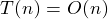
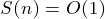
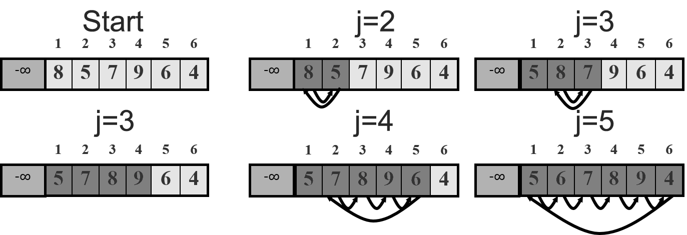

##Insert Sort [Back](./../Sort.md)
### Overview
- 插入排序 :每趟都把該元素往適當的位置插入
- 时间复杂度：
	-  (最壞平均情況) 
	-  (最好情況)
- 空間複雜度：
- 稳定性 :稳定
- 适用情况 :数据少, 初始序列基本有序

### Example


### Code
```c
void INSERTSORT(int A[], int array_size)
{
	int j;
	for (j = 1; j <= array_size - 1; j++)
	{
		int key = A[j];		//use key to store the current item
		int i = j - 1;
		while (i >= 0 && A[i] > key)	//move items bigger than it
		{
			A[i + 1] = A[i];
			i--;
		}
		A[i + 1] = key;		//push it in
	}
}
```
