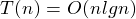

##Merge Sort [Back](./../Sort.md)
- 歸併排序: 分治思想(Divide, Conquer and Combination)
- Divide: 二分
- Conquer: 直到只有一個的時候合併
- Combination: 每次比較隊頭,較小的先放進隊列
- 时间复杂度:  (最好,平均,最壞情況)
- 空間複雜度: 
- 稳定性: 稳定
- 适用情况: 額外空間可以接受的情況下

```c
void Merge(int A[], int p, int m, int q)
{
	int n1 = m - p + 1;
	int n2 = q - (m + 1) + 1;
	int L[MAXSIZE], R[MAXSIZE];				
	for (int i = 1; i <= n1; i++)
	{
		L[i] = A[p + i - 1];
	}
	for (int j = 1; j <= n2; j++)
	{
		R[j] = A[m + j];
	}
	L[n1 + 1] = INFINITY;
	R[n2 + 1] = INFINITY;
	int i = 1;
	int j = 1;
	for (int k = p; k <= q; k++)				
	{
		if (L[i] <= R[j])
		{
			A[k] = L[i];
			i++;
		}
		else
		{
			A[k] = R[j];
			j++;
		}
	}
}

void MergeSort(int A[], int p, int q)
{
	if (p < q)
	{
		int m = (p + q) / 2;
		MergeSort(A, p, m);
		MergeSort(A, m + 1, q);
		Merge(A, p, m, q);
	}
}
```
