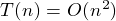
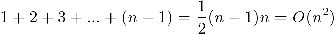
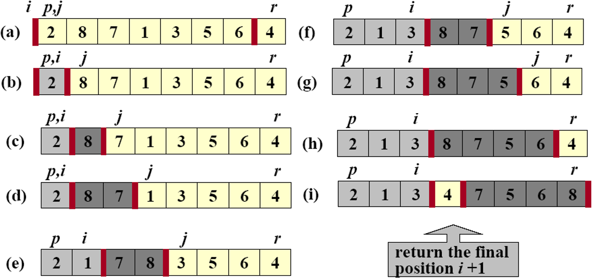

##Quick Sort [Back](./../Sort.md)
### Overview
- 快速排序: 分治思想(Divide, Conquer and Combination)
- Divide: pivot(可隨機選定)
- Conquer: 直到只有一個的時候合併
- Combination: None
- 时间复杂度: 
	-  (最好平均情況) 
	-  (最壞情況)
- 空間複雜度: 
- 稳定性: 不稳定
- 适用情况: 数据多的且無序
- 最壞情況下的比較次數: 

### Example


### Code

```c
void QUICKSORT(int A[], int p, int q)
{
	if (p < q)
	{
		int m = PARTITION(A, p, q);
		QUICKSORT(A, p, m - 1);
		QUICKSORT(A, m + 1, q);
	}
}

int PARTITION(int A[], int p, int q)
{
	int x = A[q];		//pivot
	int i = p - 1;
	for (int j = p; j <= q - 1; j++)
	{	
		count++;
		if (A[j] <= x)
		{
			i++;
			exchange(A, i, j);
		}
	}
	exchange(A, i + 1, q);
	return i + 1;
}
```

