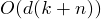

##Radix Sort [Back](./../Sort.md)
- 基數排序: 首先按最不重要的位去進行排序
- 时间复杂度:  (最好,平均,最壞情況)
- 空間複雜度: /
- 稳定性: 稳定
- 适用情况: 最大位數已知

```c
void RADIXSORT(int A[], int d)
{
	for (int i = 1; i <= d; i++);
		//use a stable sort to sort array A on digit i
}
```
