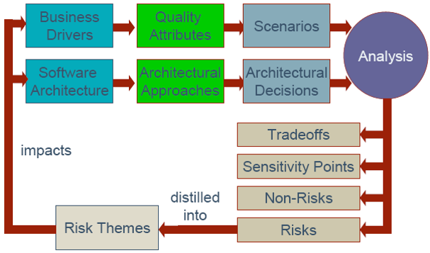

## ATAM (Architecture Tradeoff Analyse Method, 架構權衡分析法) [Back](./../Architecture.md)

- 評價軟件體系結構初稿是否滿足需求.
- ATAM更多強調質量屬性的評估, 其主要目標是為了識別風險, 分析設計, 明確權衡點並寫入文檔.
- 權衡(Tradeoff): 指多個質量屬性之間的取捨, 從而滿足需求.
- **四個概念**
	- 風險: 潛在問題, 若發生則會降低某些質量屬性的部分.
		- 三層架構下, 商業邏輯層的規則還**沒有確定**
		- 沒有檢測一個關鍵組件**是否**正常工作的機制
		- 雷達系統的每一個組件都**假定**有一個固定的轉動速率
	- 非風險: 可以提高質量, 幫助實現目標的部分
		- 假定消息的到達速率是每秒一次, 一次的處理時間小於30ms. 如果對一個更高優先級的處理, 響應時間要求是1s是**可行**的.
	- 關鍵點/敏感點: 若改變則對質量屬性產生重大影響的部分.
		- 維護系統所需的工作量和系統的通信協議以及文件格式是**密切相關**的.
	- 權衡點: 會影響多於一個質量屬性的部分.
		- 採用高強度的加密方式會提高**安全性**, 但影響**性能**
		- 為了達到**性能**要求, 不得不在底層通信組件中使用彙編語言, 但此組件不再具有**移植性**

### 1. Purpose of ATAM

i. 引導涉眾發現系統中的權衡點, 風險等信息:

- helps stakeholders to **ask the right questions** to discover potentially **problematic** architectural decisions.
- discovered **risks** can be made the focus of mitigation(緩解) activities.
- **tradeoffs** can be explicitly identified and documented.

ii. 如果能預知風險, 則可在後期加以注意和控制

### 2. Benefits

1. 識別風險
2. 澄清質量屬性需求
3. 改進文檔
4. 記錄結構化設計決定
5. 增進溝通

### 3. Phase

- Phase0: 前期準備
	- 成立核心的評估小組(包含多方面的角色)
- Phase1: 技术评估(Technical Evaluation)
	- 以技術方面的涉眾為基礎, 對體系結構進行技術性評估
    	- Present the ATAM: 讓各方瞭解ATAM的基本內容
    	- Present business drivers: 讓客戶描述系統的商業目標
    	- Present architecture: 讓Architect展示體系結構的概要, 架構師, 項目經理和市場代表一起描述此系統帶來的價值
    	- Identify architectural approaches: 確認體系結構中對實現質量需求產生決定作用的部分
    	- Generate quality attribute utility tree: 畫出效用樹來理清質量屬性要求.
    		- (H, H): (重要程度, 實現難度)
    			- L: LOW
    			- M: MIDDLE
    			- H: HIGH
    		- Root: Utility
    		- 1st Layer: Quality Attributes
    		- 2rd Layer: Word
    		- 3nd Layer: Description from the context(Scenarios: **stimulus** + **Environment** + **responses**)
    			- Use Case Scenarios: anticipated **uses** of the system
    				- Remote user requests a database report via the Web during peak period and receives it within 5 seconds.
    			- Growth Scenarios: anticipated **changes** of the system
    				- Add a new data server to reduce latency in scenario 1 to 2.5 seconds within 1 person-week.
    			- Exploratory(探究性) Scenarios: **unanticipated stresses** to the system
    				- Half of the servers go down during normal operation without affecting overall system availability.
	       
	    - Analyse Architectural Approaches
    		- 找到可以滿足最高優先級質量需求的體系結構設計方法
    		- 針對場景(H, H), 詢問與質量屬性密切相關的問題
    		- 確認四要素(風險, 非風險, 關鍵點和權衡點)

- Phase 2: 以涉眾(Stakeholders)為中心
	- 探討出Stakeholder對第一階段結果不同的意見
	- Recap Phase1
    	- Brainstorm and prioritize scenarios
    		- 通過頭腦風暴, 對質量屬性進行投票, 並決定每個Scenario的(H, H)標籤
    		- 每人 (0.3 * #Scenarios) 的票
    	- Analyse architectural approaches
    		- 分析從上一步所決定的Scenario對體系結構的影響
    	- Present results
    		- 概括和總結ATAM的所有步驟
- Phase 3: 為客戶撰寫最終的報告

### 4. Conceptual Flow

## Software Architecture Evaluation Methods

- SAAM(Software Architecture Analysis Method) Founded on Complex Scenarios(SAAMCS)
	- consider the **complexity** of evaluation scenarios as the most important risk assessment factor.
- Extending SAAM by Integration in the Domain(ESAAMI)
	- integrates SAAM with **domain-specific** and **reuse-based** software development processes.
- SAAM for Evolution and Reusability(SAAMER)
	- focus specifically on the quality attributes of **evolution** and **reusability**.
- Scenario-based Architecture Reengineering(SBAR)
	- utilize scenarios, simulation, mathematical modeling, and experience-based reasoning for assessing quality attributes. And also incorporates an architecture desgin method.
- Architecture Level Prediction of Software Maintenance(ALPSM)
	- analyse maintainability using scenarios, called **change scenarios**, which represent **maintenance** tasks.
- Software Architecture Evaluation Model(SAEM)
	- is based on **formal** and **rigorous** quality requirments.
