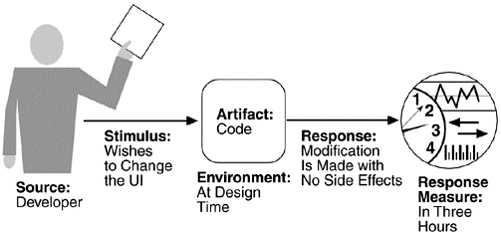
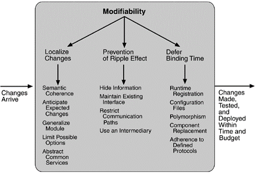

## Modifiability	[Back](./../QA.md)
- Modifiability(可修改性)注重的是一個系統修改所需的代價
- 軟件幾乎不可能不發生改變, 因為一個軟件其與外部的關係是無限的, 外界一個因素的影響都將引起系統的改變.
- 提高軟件可修改性涉及到**設計模式 (Design Pattern)**.
- 儘量達到**高內聚, 低耦合**, 降低依賴
	- 語法上的依賴(接口, 方法等)
	- 語義上的依賴(數據的語義不同)

##Scenarios(場景)

- example:

##Tatics(策略)

### 1. Localize Change
- Semantic Coherence: 維持語義的一致性
- Anticipate Expected Changes: 預測預期的修改
- Generalize Module: 通用化模塊
- Limit Possible Options: 限制可能的選項
- Abstract Common Service: 抽象出公共的服務

### 2. Prevention of Ripple Effect(漣漪效應)

- Hide information: 把類中的屬性儘量設置成private或protected.
- Maintain Existing interface: 維持現有的接口, 而不去改變它.
- Restrict Communication Path: Facade模式, 提供統一的門戶.

### 3. Defer Binding Time(延遲綁定時間)
- Runtime Registration
- Publish/Subscribe
- Configuration files: 通過配置文件避免數據寫入代碼
- Polymorphism: 動態綁定, 只有運行時才知道具體的實現
- Component Replacement: 用現成的框架去替換
- Adherence to defined protocols: 堅守已經定義的協議來修改
