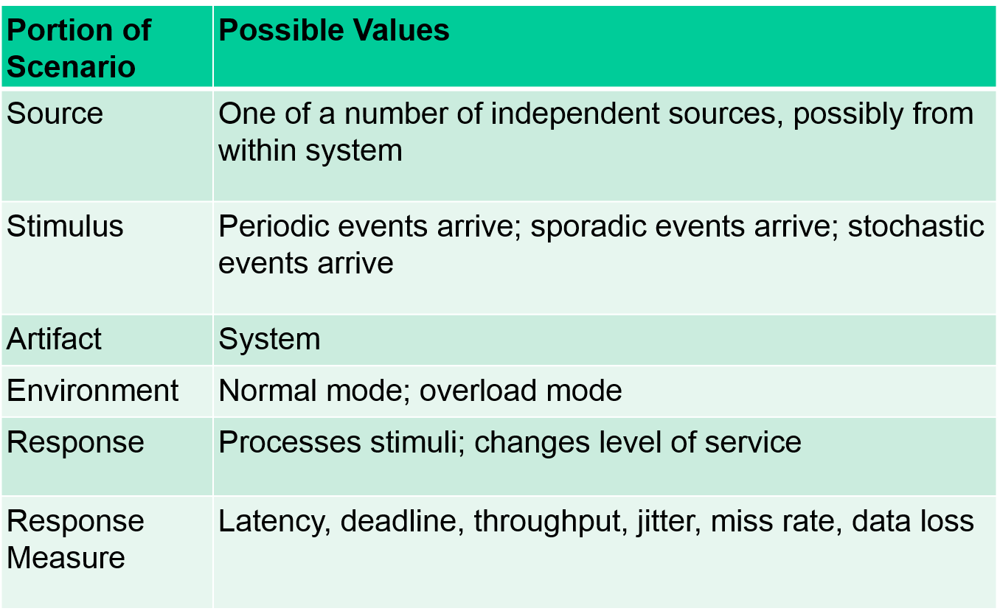
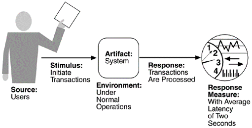
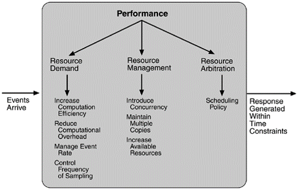

## Performance	[Back](./../QA.md)
- Performance(性能)注重的是一個系統運行的效率(基於正確的計算).
- Factors that make performance complicated is:
	- number of event sources
		- events can arrive from **user requests**, **other system**, **within the system**.
	- arrival patterns
		- 信息量到達存在週期性
		- 可通過**雲計算**解決動態申請服務器資源的問題

##Scenarios(場景)

- example:

##Tatics(策略)

### 1. Resource Demand(資源申請)
- Increase Computation Efficiency: 提高計算效率(降低算法複雜度)
- Reduce Computational Overhead: 降低計算代價
- Manage Event Rate: 管理事件到來的速率(事件未到達的情況)
- Control Frequency of Sampling: 控制採樣事件信息的頻率(事件已到達的情況)

### 2. Resource Management(資源管理)
- Introduce Concurrency: 利用多機, 多核, 多進程, 多線程來實現併發
- Matain Multiple Copies: 利用緩存
- Increase Available Resources: 增加可用資源(通過雲計算可靈活動態申請)

### 3. Resource Arbitration(資源仲裁)
- FIFO
- Round-robin
- Fixed-priority scheduling
- Changed-priority scheduling
