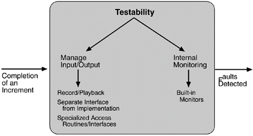

## Testability	[Back](./../QA.md)
- Testability(可測試性)衡量一個系統是否容易測試出bug.

##Scenarios(場景)

- example:

##Tatics(策略)

### 1. Manage Input/Output
- Record/Playback: 穿過介面的信息被記錄在一些倉庫內, 然後把該組件的輸出作為下一組件的輸入. (半自動化/自動化測試)
- Separate interfae from implementation: 通過對接口分離, 從而對統一接口測試不同的實現代碼
- Specialize access routes/interfaces: 提供專門的方法或接口用於測試

### 2. Internal Monitoring
- Built-in Monitors: 在IDE中設置斷電

=====

