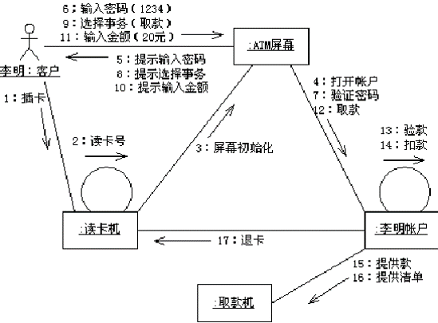

## Communication Diagram(通信圖)	[Back](./../document.md)
- 通信圖用於描述對象間的協作關係(強調**聯繫**).
- Many people find that communication diagrams are easier to alter on a whiteboard, so they are a good approach for exploring alternatives. 
- example:

