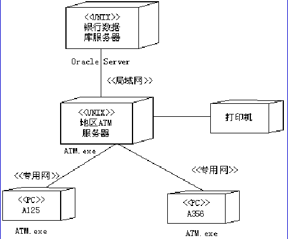

## Deployment Diagram(部署圖)	[Back](./../document.md)
- 部署圖用於描述系統如何部署到物理環境中.
- example:

- Composite Structure (suported by **UML2.0**)
	- Hierachically decompose a class into an internal structure.
	- packages are a compile-time grouping, while composite structures show runtime groupings. 

