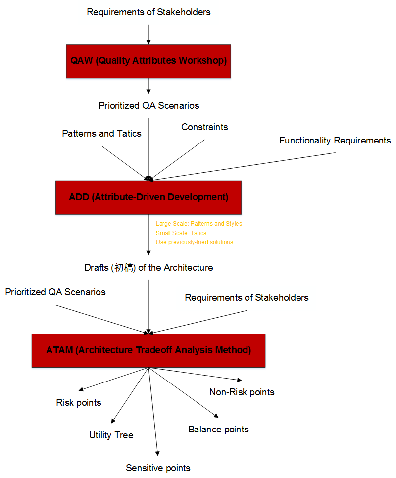

##Modeling and Documenting (建模和文檔編寫) [Back](./../Architecture.md)
- 基於體系結構開發(Architecture-based development)過程中, 將利用**體系結構**作為業務的基礎.
- The rise of software architecture has resulted from two trends:
	- Recognition of the importance of **Quality Attributes**.
	- The development of **Large and Complex** systems.
- Large-Scale design decisions cannot be made by programmers, but by architects.
	- Have limited visibility and short-term perspectives. (細節的代碼無法把握全局)
	- Trained in technology solutions to specific problems. (掌握解決具體問題的技術, 但無法達到特定的質量要求)
- **Analyse**: decomposing a whole into parts
- **Design**: deciding how the parts work together

##Architecture-based development proccess

##Documenting

- **7** principles:
	1. Write from the point of view of the reader: 根據用戶的角度來寫文檔
	2. Avoid unnecessary repetition: 避免文檔內容的重複
		- 重複可能帶來二義性
		- 不易於使用和修改
	3. Avoid ambiguity: 避免文檔的二義性(可用字典**(key, description)**來解決問題)
	4. Use a standard organization: 採用主流模版, 無需部分空著不寫
	5. Record rationale: 提出理論基礎來保持文檔的合理性
	6. Keep documentation current, but not too current: 不要頻繁更新文檔
	7. Review documentation for fitness of purpose: 查看所寫文檔是否合乎初衷
- 從不同視角, 不同顆粒度看系統會看到不同的結構.
- **4+1 View**: 用於從不同的視角去描述一個軟件系統(結合UML圖)
	- Logic View: 系統的抽象描述([**Class Diagram**](./class/class.md), [**Object Diagram**](./object/object.md), [**State Diagram**](./state/state.md), **Interaction Diagram**)
	- Process View: 系統的業務過程([**Activity Diagram**](./activity/activity.md), [**State Diagram**](./state/state.md), [**Communication Diagram**](./communication/communication.md), [**Sequence Diagram**](./sequence/sequence.md), [**Timing Diagram**](./timing/timing.md), [**Interaction Overview Diagram**](./interaction/interaction.md))
	- Development View: 系統的組織關係([**Package Diagram**](./package/package.md), [**Component Diagram**](./component/component.md))
	- Physical View: 系統的部署([**Deployment Diagram**](./deployment/deployment.md))
	- **Use-case View**: 系統的功能描述([**Use-case Diagram**](./usecase/usecase.md))
- Responsibility for different people:

- UML(Unified Modeling Language, 統一建模語言)
	- No Concept of **Layer**
	- the **De Facto** standard language
