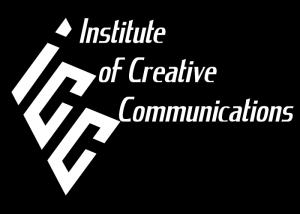
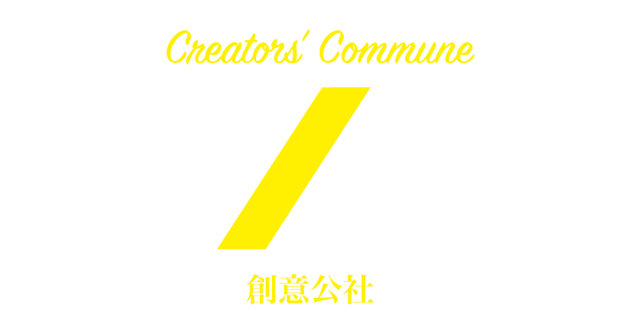

## Creativity	[Back](./../Readme.md)
###More than a Coder, more than a Designer.
- 能用編程實現一個程序的人, 我泛指**Coder**.
- 能用工具畫出一張圖的人, 我泛指**Designer**.
- 但我的目標是要超越這兩個泛指, 成為一個更高層次的人才, 我泛指**Creator**

### Website

* [**Zcool**](http://www.zcool.com.cn/)

* [**Behance**](http://behance.net/)

* [**Codrops**](http://tympanus.net/codrops/)

* [**Smashing Magazine**](http://www.smashingmagazine.com/)

* [**ICC**(Institute of Creative Communications)](http://www.iccworld.org/)

* [**theDesignInspirations**](http://thedesigninspiration.com/)

* [**聚*創意公社 La Camomille**](http://www.lacamomille.net/zh/)

=====

