## The design of PARWAN [Back](../Embedded_System.md)

### **TOP** DESIGN

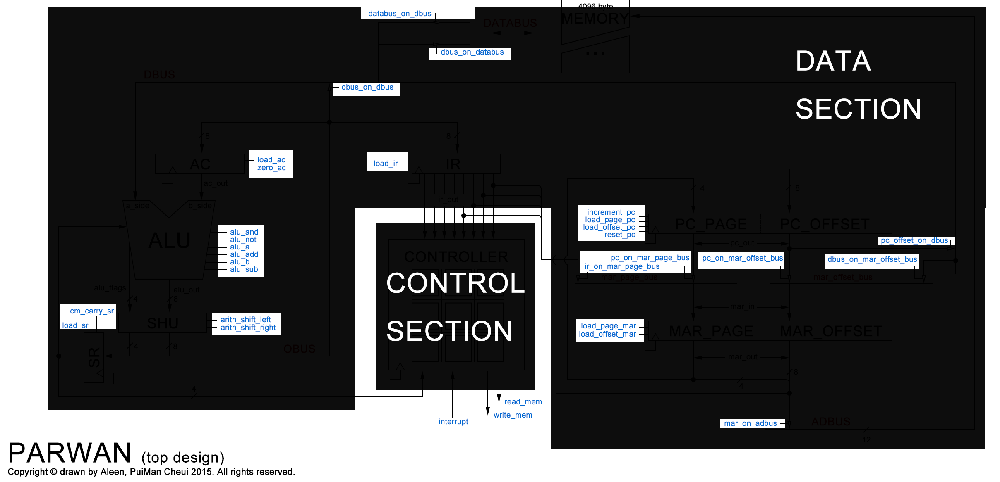

### **DOWN** DESIGN

### **7** Components

#### ALU (Arithmetic Logic Unit)

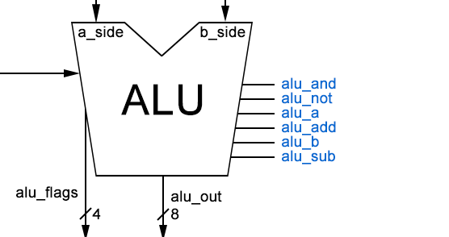

#### AC (Accumulator)

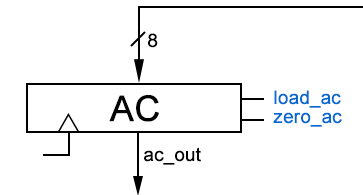

#### SHU (Shifter Unit)

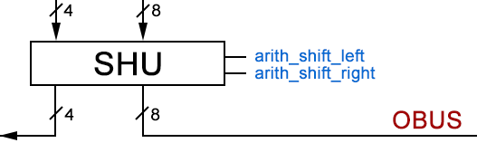

#### SR (Shifter Register)

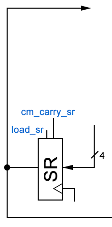

#### IR (Instruction Register)

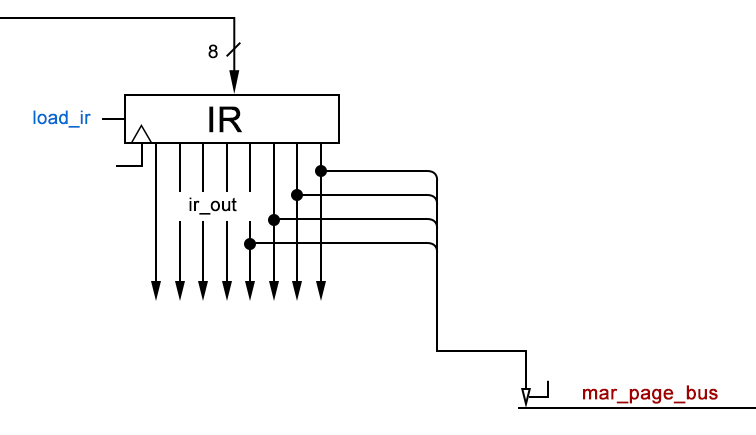

#### PC (Program Counter)

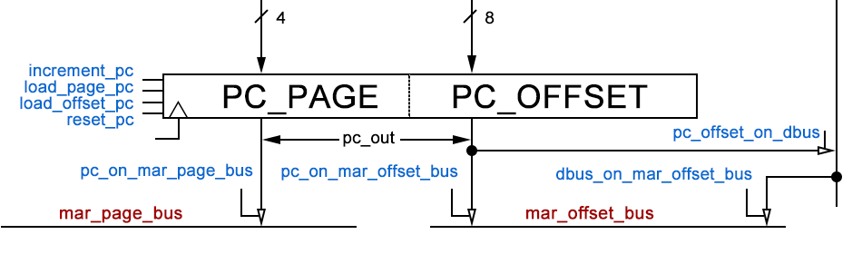

#### MAR (Memory Address Register)

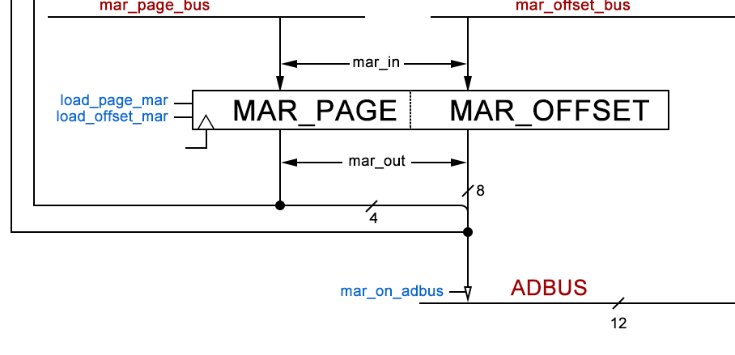

### **STATE MACHINE** of **Control Section**

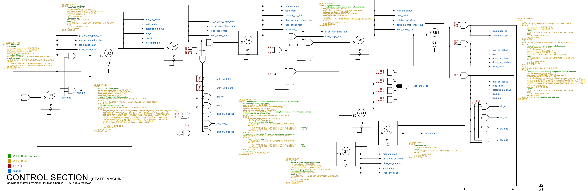

### **9** States

#### State 1

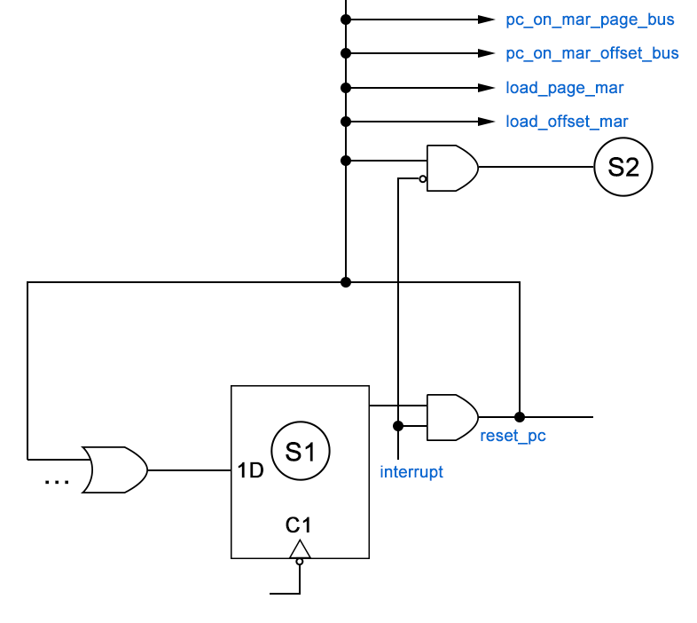

#### State 2

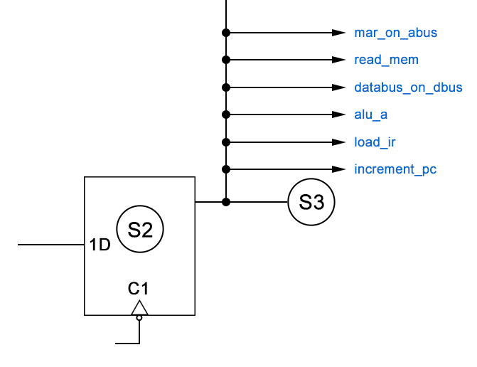

#### State 3

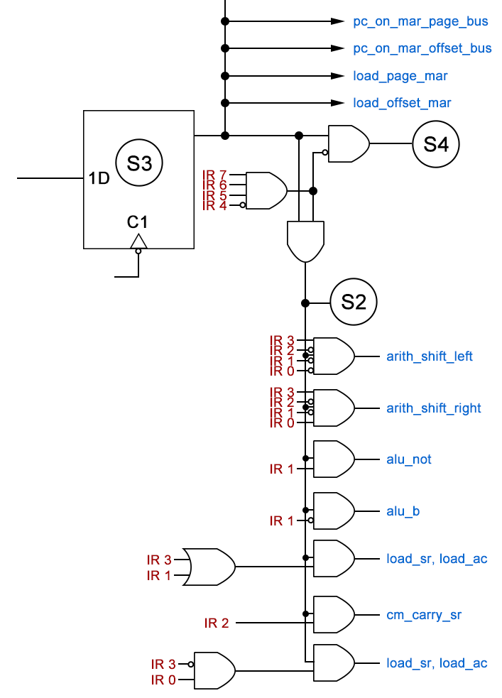

#### State 4

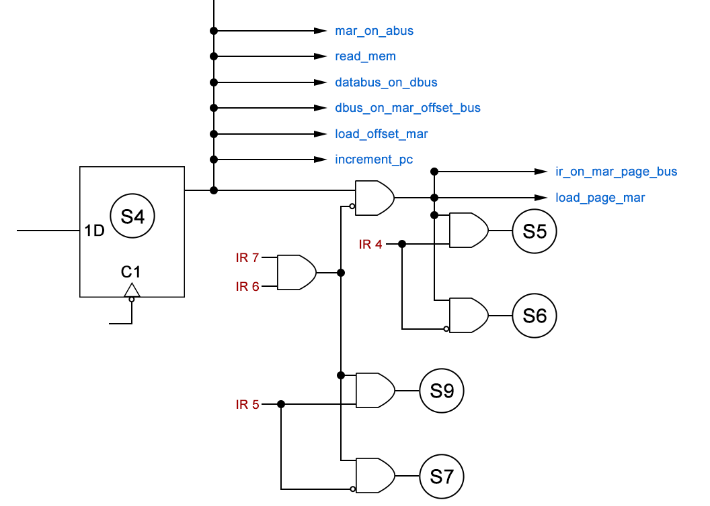

#### State 5

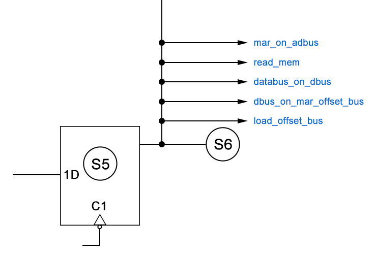

#### State 6

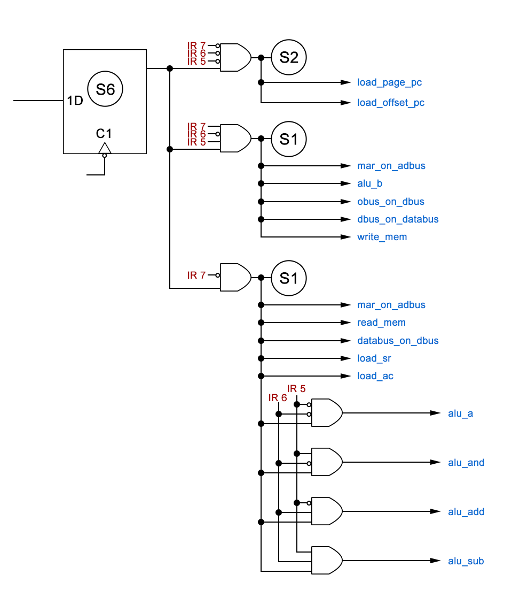

#### State 7

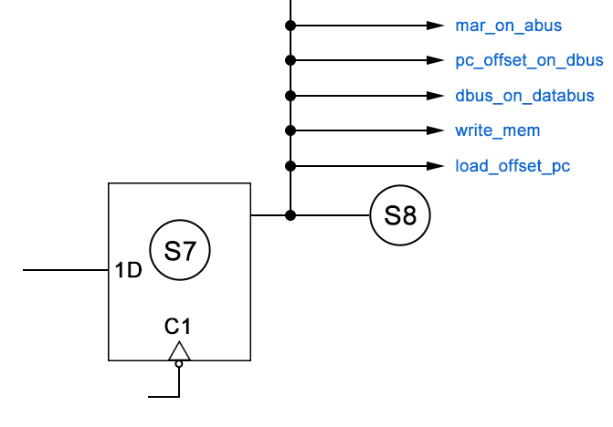

#### State 8

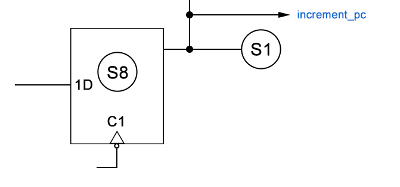

#### State 9

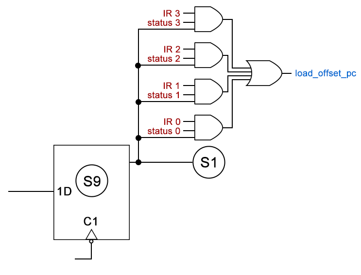

