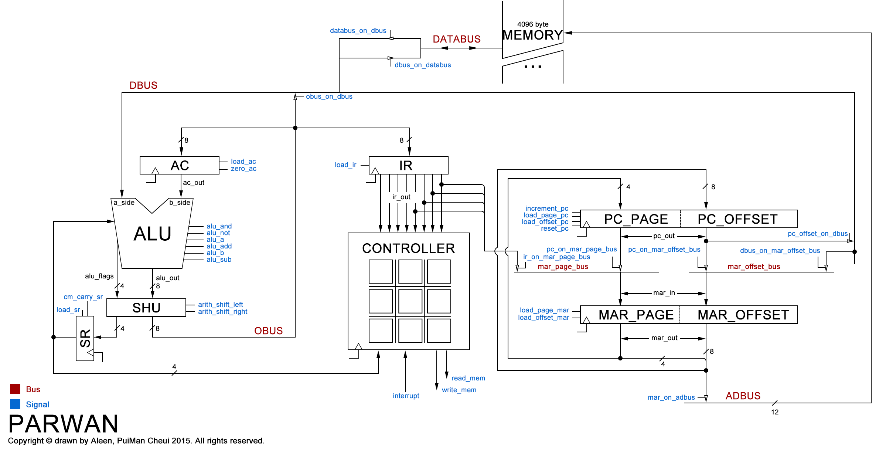

##PARWAN Picture

- **TOP** DESIGN[[**Orginal View**](https://raw.githubusercontent.com/aleen42/PersonalWiki/master/Embedded_System/PARWAN/PARWAN_DESIGN\(top%20design\).png)]

- **DOWN** DESIGN[[**Orginal View**](https://raw.githubusercontent.com/aleen42/PersonalWiki/master/Embedded_System/PARWAN/PARWAN_DESIGN.png)]

- **7** Components
	- ALU(Arithmetic Logic Unit)

	- AC(Accumulator)

	- SHU(Shifter Unit) 

	- SR(Shifter Register) 

	- IR(Instruction Register) 

	- PC(Program Counter) 

	- MAR(Memory Address Register) 

- **STATE MACHINE** of **Control Section**[[**Orginal View**](https://raw.githubusercontent.com/aleen42/PersonalWiki/master/Embedded_System/PARWAN/Control_Section.png)]

=====

