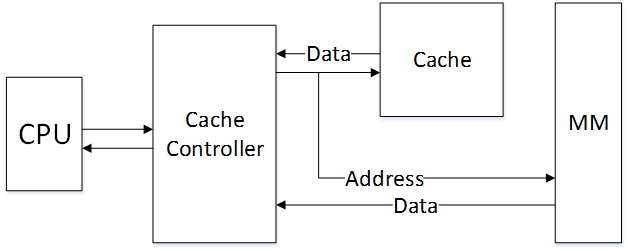
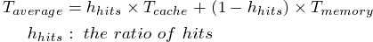
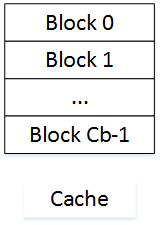
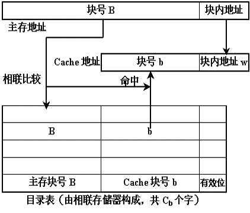
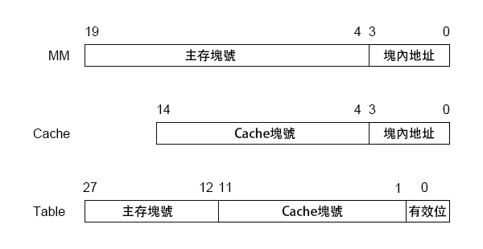
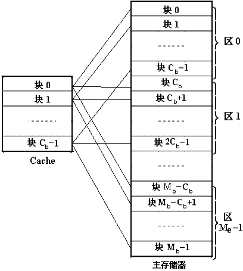
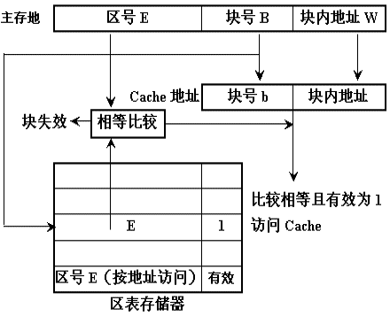
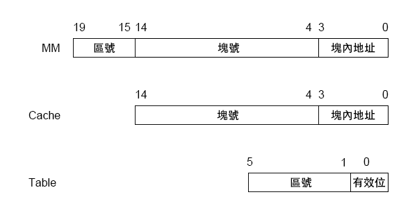
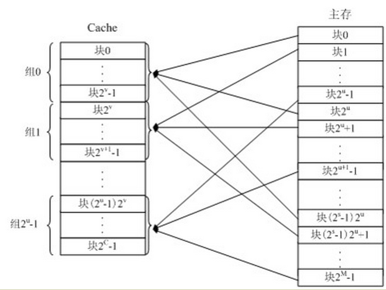
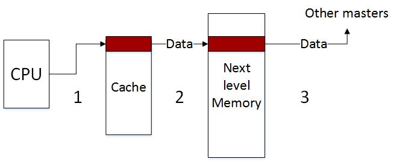

##Cache	[Back](./../Embedded_System.md)

- Cache(高速緩存)是一種**存儲器**.
- Cache的出現是為了解決內存速度落後於CPU計算速度, 從而導致CPU資源浪費的問題.
- Cache的訪問速度遠高於內存(Main Memory), 但是Cache的空間比內存要小.
- 有效的Cache存放策略將減少CPU平均訪問數據的時間
- Freeze模式(凍結): 指的是Cache數據凍結, 而不被訪問. CPU直接繞過它訪問下一級存儲器或DDR(Cache自動凍結時鐘)

- **命中**: 指CPU要訪問的數據儲存在Cache中
- 數據的平均訪問時間(只有一個Cache的情況): 
	

- 多級Cache: CPU->L1->L2->MM(Main Meomory).
- **L1**通常集成在CPU片內, 通常分有**Program(L1P)**部分和**Data(L1D)**部分.
- **L2**通常集成在CPU片外, 與控制器同級, 是作為**仲介者**的角色存在.
- 從內到外, 訪問速度越來越慢, 存儲容量越來越大.

## Address Mapping(地址映射)

- 地址映射指**內存地址**映射到**Cache地址**.
- 如果Cache有**Cb**塊, 主存有**Mb**塊, 則映射關係共有Cb*Mb種.

#### 1. 全相聯方式

- 主存的的任意一塊映射到Cache的任意一塊
- 目錄表數量等於Cache塊的數目
- 優點: Cache命中率高, 存儲空間利用率高  
- 缺點: 訪問速率較低, 需要遍曆整張目錄表

- example
	- Main Memory: 1MB
	- Cache: 32KB
	- Block: 16B

#### 2. 直接相聯方式

- 主存的一塊只能映射到Cache的一個特定塊中
- 主存容量是Cache容量的整數倍
- 目錄表數量等於Cache塊的數目
- 優點: 數據訪問時, 直接通過塊號去訪問目錄表, 因此訪問速度較快.
- 缺點: Cache中替換操作頻繁, 命中率較低

- example
	- Main Memory: 1MB
	- Cache: 32KB
	- Block: 16B

#### 3. 組相聯方式

- 混合了**全相聯**和**直接相聯**.
- 主存的塊只能映射到特定的**組**, 組內映射到任意的塊
- 優點: 結合了前兩種相聯方式的優點
- 缺點: 實現難度較大

## Cache一致性
- 當不命中時, CPU直接把待寫的數據寫入主存
- 當命中時, 有兩種寫入方式:
	- 寫回法: 只更新Cache, 並標記. 當移出Cache時, 再更新主存.
	- 寫直達法: 同時更新Cache和主存
- 保持Cache一致性的兩種協議:
	- 監聽總線協議
	- 基於目錄協議
- C64X+平臺:
	- case1: 代碼在L1P 
	- case2: 代碼在L2 (需軟件維護)
	- case3: 代碼在DDR (需軟件維護)
	- case4: 數據在L1D
	- case5: 數據在L2
	- case6: 數據在DDR (需軟件維護)

### 1. 讀一致性問題

1. 外部master更新內存數據
2. 數據更新到Cache中
3. Core讀到更新的數據

### 2. 寫一致性問題

1. CPU更新數據
2. Cache寫回內存
3. 外部master讀到更新的數據
