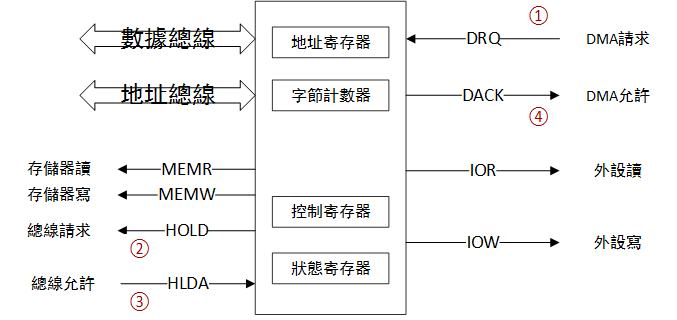
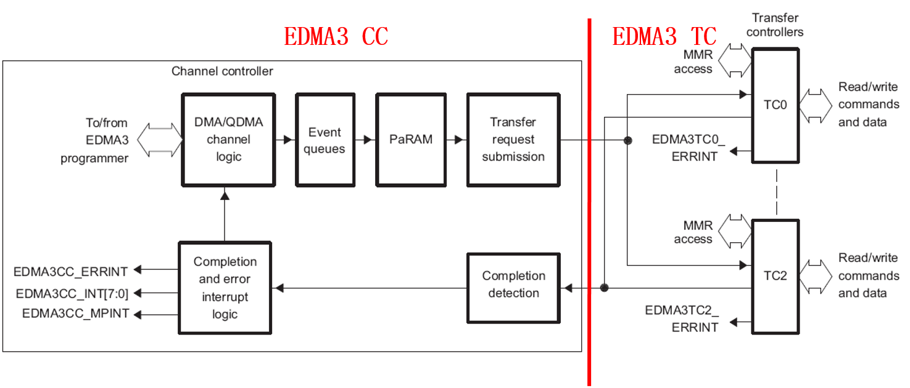
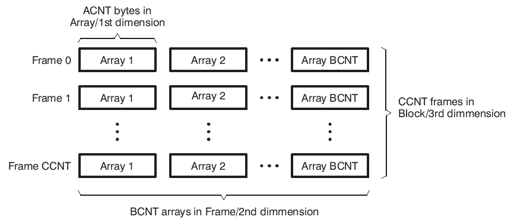
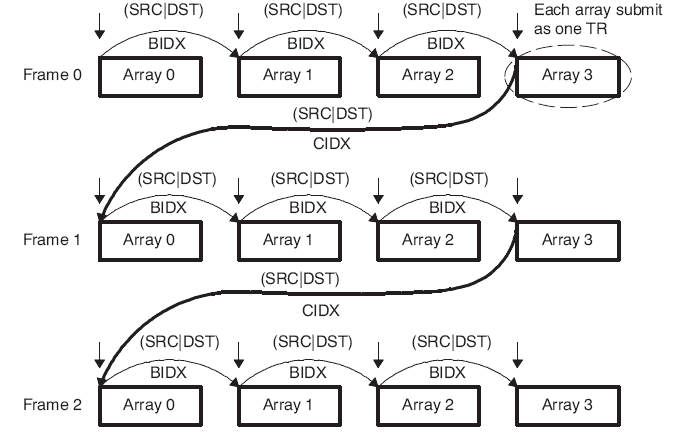
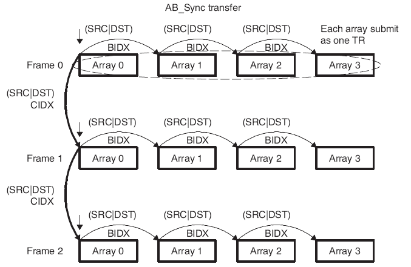
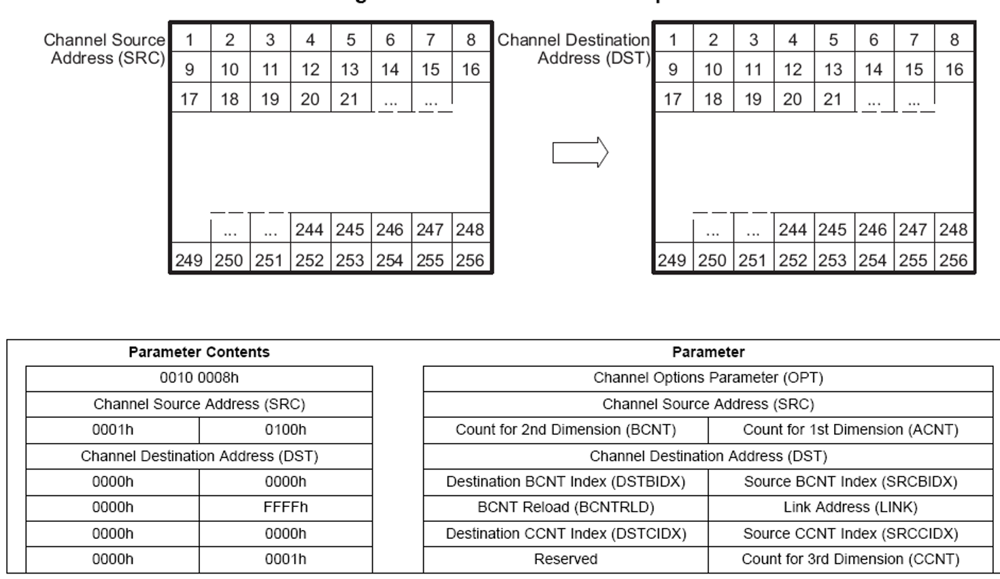
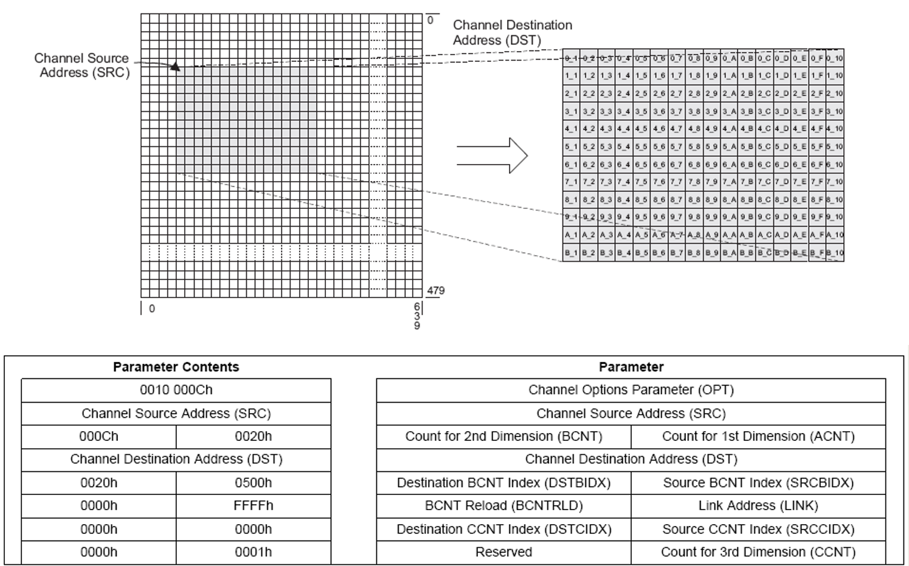
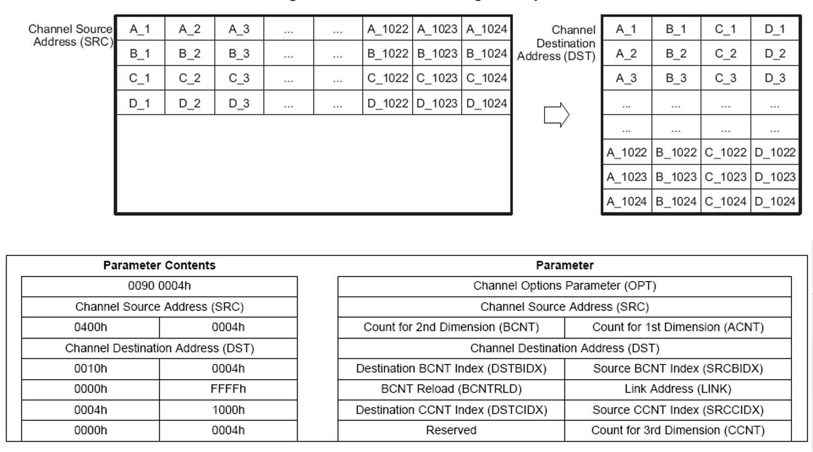

##DMA (Direct Memory Access, 直接內存訪問)	[Back](./../Embedded_System.md)

- DMA目的是為了減少CPU讀取寫回數據時所消耗的資源, 其工作原理是替代CPU進行數據讀寫操作
- DMA控制器:

- EDMA: 增強型DMA
	- CC: 作為整個控制器的用戶接口, 完成**通道控制**, **中斷控制**和**向TC發送傳輸請求**的功能
	- TC: 負責真正的數據傳輸
- EDMA傳輸方式:
	- Link: 多個事件觸發多個EDMA搬移, 只使用**一個通道**. (一個通道完成自動開始另一個通道)
	- Chain: 一個事件觸發多個EDMA搬移, 使用**多個通道**. (一次搬移後, 自動覆蓋新的參數)

- EDMA3數據傳輸分類:
	- 一維DMA: 由ACNT連續字節組成
	- 二維DMA: 由BCNT+ACNT組成
	- 三維DMA: 由CCNT+BCNT+ACNT組成

- EDMA3數據傳輸方式
	- A-Synchronized Transfers: 每個事件包只傳遞一個Array的傳輸信息(需要BCNT * CCNT個事件包) 
	- AB-Synchronized Transfers: 每個事件包傳遞一個Frame(BCNT Arrays)的傳輸信息(需要CCNT個事件包) 

- 參數配置:
	- ACNT: Count for 1st Dimension
	- BCNT: Count for 2nd Dimension
	- CCNT: Counf for 3rd Dimension
	- SRCBIDX: 原來跳一個Array需要多少位
	- DSTBIDX: 現在跳一個Array需要多少位
	- SRCCIDX: 原來跳一個Frame需要多少位
	- DSTCIDX: 現在跳一個Frame需要多少位

- EDMA3塊數據搬移(整體搬移)

- EDMA3抽取部分數據搬移

- EDMA3數據排序搬移 (倒置搬移)

