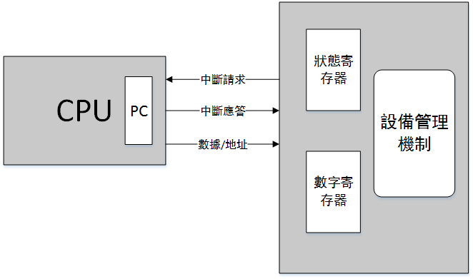
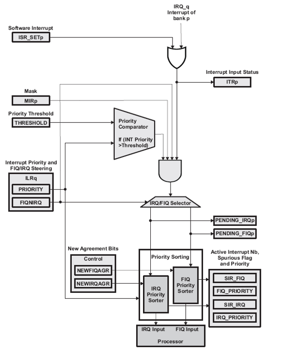
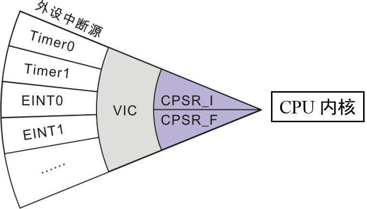
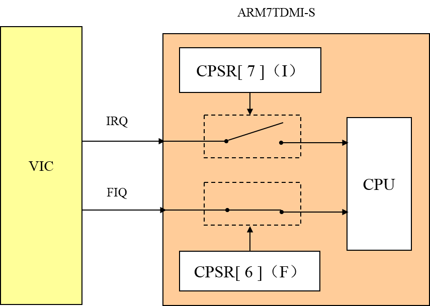
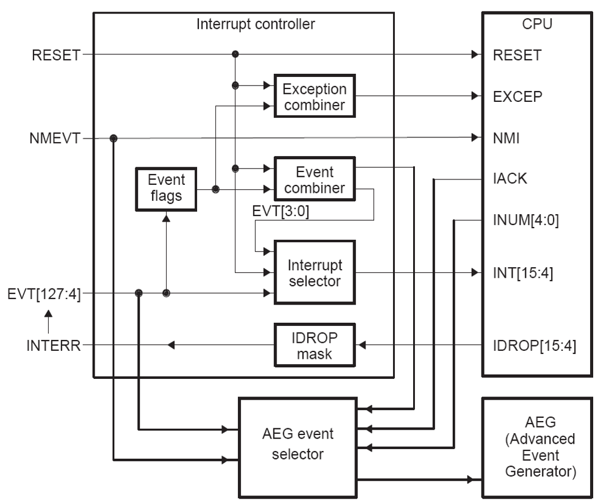
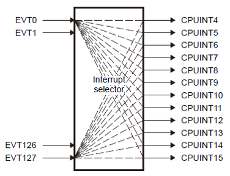

##Interruption(中斷)		[Back](./../Embedded_System.md)

- 中斷請求: CPU在執行每條指令前檢查中斷請求線上是否有中斷請求
- 中斷應答: 根據中斷的類型(即中斷優先級), 在適當的時候返回應答.
- 數據/地址: CPU將PC指針重新指向中斷程序的地址.
- 棧結構: 在中断程序執行之前通過**棧結構**來存儲當前寄存器數據.
- 中斷屏蔽: 高優先級的中斷請求屏蔽掉較低優先級的請求, 而先被執行.
- 中斷向量表: 存放**中斷向量**
	- 中斷向量: 用於定位中斷程序的地址
	- 設備收到中斷應答後給CPU發送中斷向量
- 中斷觸發方式:
	- **邊沿**觸發
	- **電平**觸發

- **A8**內核具有兩種中斷輸入
	- IRQ中斷(CPSR_I, CPSR[7]): 具有一般優先級的中斷
	- FIQ中斷(CPSR_F, CPSR[6]): 具有最高優先級的中斷

- VIC(Vector Interruption Controller, 向量中斷控制器)負責管理芯片的中斷源, 最多可管理**93**個中斷請求.
- VIC Registers
	- VICVectAddr0 ~ VICVectAddr31: 向量地址寄存器
	- VIC0Addr: 中斷地址寄存器
	- VIC0IntSelect: 中斷選擇寄存器, 將32個中斷請求劃分成FIQ或IRQ
	- VIC0IntEnable: 中斷使能寄存器, 控制32個中斷請求的使能
	- VIC0IntEnClr: 中断使能清零寄存器, 將中断使能寄存器的一個或多個位清零
	- VICIRQStatus: IRQ狀態寄存器, 可讀出定義為IRQ並使能的中斷的狀態
	- VICFIQStatus: FIQ狀態寄存器, 可讀出定義為FIQ並使能的中斷的狀態
	- VICRawIntr: 所有中斷狀態寄存器, 可讀出所有中斷的狀態
- CPSR[6], CPSR[7]: **0**代表**使能**, **1**代表**禁止**
- IRQ中斷執行過程:
	- 1. 正在執行用戶程序
	- 2. 外部中斷IRQ產生
	- 3. VIC將中斷向量放入寄存器VICVectAddr寄存器中
	- 4. 跳到中斷向量表找中斷程序入口地址
	- 5. 跳到中斷程序入口地址執行程序
	- 6. 執行完畢返回到中斷產生前用戶程序執行的指令的下一條指令
- IRQ處理過程:
	- 1. 發生IRQ中斷
	- 2. 備份當前程序狀態寄存器
	- 3. 切換到IRQ處理模式
	- 4. IRQ中斷關閉
	- 5. 保存返回地址
	- 6. 設置IRQ入口地址
- 外部中斷源(External Interruption Sources)分組管理(**4組**)
	- EXT_INT_0
	- EXT_INT_1
	- EXT_INT_2
	- EXT_INT_3
- External Interruption Sources Registers
	- EXT_INT_0_CON: 設置中斷方式寄存器
		- EXT_INT_0_CON[0]: 中斷源0 [2:0]
			- 000: Low level
			- 001: High level
			- 010: Falling edge triggered
			- 011: Rising edge triggered
			- 100: Both edge triggered
			- 101~111: Reserved
		- EXT_INT_0_CON[1]: 中斷源1 [6:4]
			- 000: Low level
			- 001: High level
			- 010: Falling edge triggered
			- 011: Rising edge triggered
			- 100: Both edge triggered
			- 101~111: Reserved
	- EXT_INT_0_FLTCON0/EXT_INT_0_FLTCON1: 設置外部中斷源濾波器寄存器
	- EXT_INT_0_MASK: 設置中斷掩碼寄存器
	- EXT_INT_0_PEND: 設置中斷掛起寄存器

##DSP C64X+ 和 C54X中斷系統

### C64X+

- RESET, CPU複位
- NMI, 不可屏蔽中斷
- EXCEP, 硬件異常
- INT, 可屏蔽普通中斷[15:4]
- Interrupt Selector, 將EVT[127:0]事件映射到CPUINT[15:4]
	- [127:4]是系統事件
	- [3:0]是組合事件, 通過或運算來控制不同事件的組合

### C54X

- **可屏蔽中斷**和**不可屏蔽中斷**
- 支持**軟件中斷**和**硬件中斷**
- 硬件中斷(具有優先級, 1表示最高優先級)
	- 外部硬件中斷: INT0~INT3
	- 內部硬件中斷: 定時器, 串行接口, 主機接口引起的中斷
- 軟件中斷(不具有優先級)
- 寄存器:
	- IFR: 中斷標誌寄存器, 對各硬件中斷進行標誌
	- IMR: 中斷屏蔽寄存器, 對硬件中斷進行屏蔽或使能(**0**代表**禁止**, **1**代表**使能**)
- 中斷響應過程:
	1. 接受中斷請求
	2. 應答中斷
	3. 執行中斷服務程序
	4. 返回主程序繼續執行
