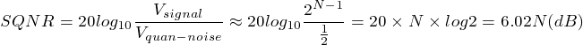
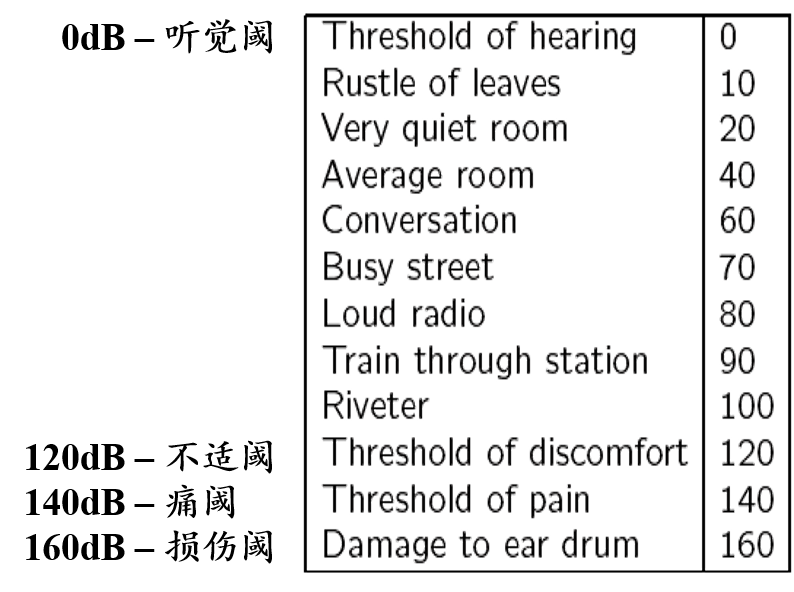
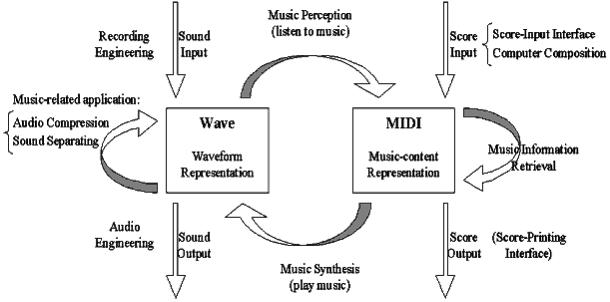

## Multimedia	[Back](./../Readme.md)

### Chapter1: Introduction
- 多媒體是融合兩種以上媒體的人機交互式信息交流和傳播媒體
	- 多媒體是信息交流和傳播媒體
	- 多媒體是人機交互式媒體
	- 多媒體信息都是以數字形式存儲和傳輸的
	- 多媒體是融合兩種以上的媒體
- 多媒體數據量大, 帶來傳輸和存儲問題
	- 解決辦法: 數據壓縮與解壓縮
- 媒體種類:
	- preception medium(感知媒體): 能直接作用於人的感官, 使人產生感覺的媒體. 感覺媒體包括人類語言, 音樂和自然界各種聲音, 活動圖像, 圖形, 曲線, 動畫, 文本等.
	- representation medium(表示媒體): 為傳輸感知信息而研究出來的中間手段, 包括語音編碼, 音樂編碼, 圖像編碼, 文本編碼, 活動圖像編碼和靜止圖像編碼等.
	- presentation medium(顯示媒體): 用於通信中電信號與感官媒體之間轉換所用的媒體, 分**輸入顯示媒體**和**輸出显示媒体**兩種.
	- intercahnge medium
		- storage medium(存儲媒體): 用於存儲表示媒體(如硬盤, 軟盤, 光盤, 磁帶和存儲器等)
		- transmission medium(傳輸媒體): 用於傳輸表示媒體的物理實體(如電話線, 雙絞線, 銅軸電纜, 光釺, 無線電和紅外線等)

- **4** characteristics of a **multimedia system**
	- system must be computer controlled
		- 在計算機的控制下, 以交互方式表示信息; 捕獲, 處理和產生信息; 提供共享存儲能力; 傳輸多媒體信息.
	- system must be integrated
		- 盡可能用集成化方法完成產生, 存儲, 傳遞和顯示信息的功能
	- information must be represented digitally
		- 以二進制序列描述數據
	- interface is usually interactive
		- 第一級別交互: 用戶僅能選擇顯示開始時間, 次序, 速度或信息項
		- 第二級別交互: 用戶的輸入能夠被記錄, 以便加注, 修改或豐富信息
		- 第三級別交互: 對用戶輸入準確處理, 然後產生應答

- size of 1 minute digital audio

- size of 1 minute digital vedio

### Chapter2: Basic of Digital Audio

- 聲音是一種像光的波, 但在某些物理設備上能被壓縮和擴張
- 人的聽覺範圍: **20~20000Hz**
- 次聲波: **<20Hz**
- 超聲波: **>20000Hz**
- 聲音是时基媒体
	- 時基媒體(Time-based Media): 時間依賴的連續媒體
- 泛音: 物體局部震動產生的次要頻率
- 基音: 物體整體震動產生的最大頻率
- 樂音: 泛音是基音的**整數**倍
- 噪音: 泛音是基音的**非整數**倍
- 信噪比(SNR): 
- 信號量化噪聲比(SQNR): 
- 聲音等級(dB):  
- 雙耳定位: 通過雙耳判斷聲源的方向和遠近
- HRTF(Head-Related Transfer Function): 聲波從自由場傳到鼓膜處的變換函數[[**more details**](http://sound.media.mit.edu/resources/KEMAR.html)]
- SRS(Sound Retrieval System): 利用兩個揚聲器獲得環繞立體聲的3D立體聲系統
- 數據量計算: 數據量(Byte)=採樣頻率(Hz)*(採樣位數/8)*聲道數*時間(s)
- 音樂基本組成部分
	- pitch(音高): 基音的頻率決定
	- loudness(響度): 聲波的振幅決定
	- timbre(音色): 基音與泛音的比例決定
	- time(時值): 震動的持續時間
- 計算機音樂研究
	- 合成
		- FM Synthesis(頻率調製合成)
		- Wavetable Synthesis(波表合成)
	- 檢索
	- 感知
	- 處理

- MIDI(Musical Instrument Digital Interfaces): 用於音樂合成, 樂器和計算機之間交換音樂信息的一種標準協議
- MIDI信息以**MIDI MESSAGE**來傳輸, 是控制設備執行某個動作從而產生聲音的指令

> MIDI messages
>> channel messages
>>> voice messages: 攜帶演奏數據

>>> mode messages: 表示合成響應MIDI數據的方式

>> system messages
>>> common messages: 標識系統中的所有接收器

>>> real-time messages: MIDI部件之間同步

>>> exclusive messages: 廠商的標識代碼

- MIDI數據流是單向異步, 每字節10bits(8bits **data**+1bit **start**+1bit **end**). 數據率為31.25kbps
- MIDI串行接口

### Chapter3: Basics of Color and Image

### Chapter4: Fundamental Concepts in Video

### Chapter5: Lossless Compression Algorithmns

### Chapter6: Lossy Compression Algorithmns

### Chapter7: Image Compression Algorithmns

### Chapter8: Basic Audio Compression Techniques

### Chapter9: Basic Video Compression Techniques

### Chapter10: Visual Coding in MPEG-4, Other MPEG Standards

### Chapter11: Computer and Multimedia Networks

### Chapter12: Multimedia Communication

=====

