## Multimedia	[Back](./../Readme.md)

### Chapter1: Introduction
- 多媒體是融合兩種以上媒體的人機交互式信息交流和傳播媒體
	- 多媒體是信息交流和傳播媒體
	- 多媒體是人機交互式媒體
	- 多媒體信息都是以數字形式存儲和傳輸的
	- 多媒體是融合兩種以上的媒體
- 多媒體數據量大, 帶來傳輸和存儲問題
	- 解決辦法: 數據壓縮與解壓縮
- 媒體種類:
	- preception medium(感知媒體): 能直接作用於人的感官, 使人產生感覺的媒體. 感覺媒體包括人類語言, 音樂和自然界各種聲音, 活動圖像, 圖形, 曲線, 動畫, 文本等.
	- representation medium(表示媒體): 為傳輸感知信息而研究出來的中間手段, 包括語音編碼, 音樂編碼, 圖像編碼, 文本編碼, 活動圖像編碼和靜止圖像編碼等.
	- presentation medium(顯示媒體): 用於通信中電信號與感官媒體之間轉換所用的媒體, 分**輸入顯示媒體**和**輸出显示媒体**兩種.
	- intercahnge medium
		- storage medium(存儲媒體): 用於存儲表示媒體(如硬盤, 軟盤, 光盤, 磁帶和存儲器等)
		- transmission medium(傳輸媒體): 用於傳輸表示媒體的物理實體(如電話線, 雙絞線, 銅軸電纜, 光釺, 無線電和紅外線等)

- **4** characteristics of a **multimedia system**
	- system must be computer controlled
		- 在計算機的控制下, 以交互方式表示信息; 捕獲, 處理和產生信息; 提供共享存儲能力; 傳輸多媒體信息.
	- system must be integrated
		- 盡可能用集成化方法完成產生, 存儲, 傳遞和顯示信息的功能
	- information must be represented digitally
		- 以二進制序列描述數據
	- interface is usually interactive
		- 第一級別交互: 用戶僅能選擇顯示開始時間, 次序, 速度或信息項
		- 第二級別交互: 用戶的輸入能夠被記錄, 以便加注, 修改或豐富信息
		- 第三級別交互: 對用戶輸入準確處理, 然後產生應答

- size of 1 minute digital audio

- size of 1 minute digital vedio

### Chapter2: Basic of Digital Audio

- 聲音是一種像光的波, 但在某些物理設備上能被壓縮和擴張
- 人的聽覺範圍: **20~20000Hz**
- 次聲波: **<20Hz**
- 超聲波: **>20000Hz**
- 聲音是时基媒体
	- 時基媒體(Time-based Media): 時間依賴的連續媒體
- 泛音: 物體局部震動產生的次要頻率
- 基音: 物體整體震動產生的最大頻率
- 樂音: 泛音是基音的**整數**倍
- 噪音: 泛音是基音的**非整數**倍
- 信噪比(SNR): 
- 信號量化噪聲比(SQNR): 
- 聲音等級(dB):  
- 雙耳定位: 通過雙耳判斷聲源的方向和遠近
- HRTF(Head-Related Transfer Function): 聲波從自由場傳到鼓膜處的變換函數[[**more details**](http://sound.media.mit.edu/resources/KEMAR.html)]
- SRS(Sound Retrieval System): 利用兩個揚聲器獲得環繞立體聲的3D立體聲系統
- 數據量計算: 數據量(Byte)=採樣頻率(Hz)*(採樣位數/8)*聲道數*時間(s)
- 音樂基本組成部分
	- pitch(音高): 基音的頻率決定
	- loudness(響度): 聲波的振幅決定
	- timbre(音色): 基音與泛音的比例決定
	- time(時值): 震動的持續時間
- 計算機音樂研究
	- 合成
		- FM Synthesis(頻率調製合成)
		- Wavetable Synthesis(波表合成)
	- 檢索
	- 感知
	- 處理

- MIDI(Musical Instrument Digital Interfaces): 用於音樂合成, 樂器和計算機之間交換音樂信息的一種標準協議
- MIDI信息以**MIDI MESSAGE**來傳輸, 是控制設備執行某個動作從而產生聲音的指令

> MIDI messages
>> channel messages
>>> voice messages: 攜帶演奏數據

>>> mode messages: 表示合成響應MIDI數據的方式

>> system messages
>>> common messages: 標識系統中的所有接收器

>>> real-time messages: MIDI部件之間同步

>>> exclusive messages: 廠商的標識代碼

- MIDI數據流是單向異步, 每字節10bits(8bits **data**+1bit **start**+1bit **end**). 數據率為31.25kbps
- MIDI串行接口

### Chapter3: Basics of Color and Image

- 顏色僅是視覺系統的一種屬性(或腦物質的一種屬性), 並不是光的屬性. 光僅僅具有波長與頻率這種物理性質, 並不具有顏色性質
- 條件等色: 光譜分佈不同但看上去相同的顏色
- 顏色三要素:
	- 色調: 反映顏色的類別(對應光譜中的主波長)
	- 飽和度: 彩色光所呈現顏色的深淺或純潔程度(100%飽和度指沒有混入白光的純色光)
	- 亮度: 光波振幅, 即光能量(人眼對**亮度**非常敏感)
- 顏色模版(Color Models): 精確標定和生成各種顏色的一套規則和定義
	- HSL: 色調, 飽和度和亮度(對於人)
	- RGB: 紅, 綠, 藍磷光體(對於顯示設備)
	- CMYK: 青色, 品紅, 黃色和黑色(對於打印設備)
	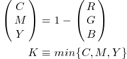
	- L\*a\*b: 光亮度分量, 綠到紅分量, 藍到黃分量
- 視頻顏色空間模型:
	- YIQ: 亮度, 兩個彩色分量(NTSC彩色電視制式)
	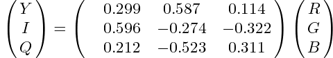
	- YUV: 亮度, 兩個彩色分量(PAL, SECAM彩色電視制式)
	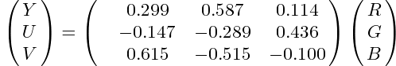
	- YCbCr: JPEG,MPEG 壓縮, 高質量彩色視頻
- YIQ/YUV利用人眼對亮度較敏感的特性, 降低數字彩色圖像的存儲容量
- γ校正: 由於光電轉換的非線性特性, 因此引入γ校正來改善圖片效果
- 圖
	- 矢量圖像(Graphics)
	- 位圖圖像(Image)
		- 屬性
			- 分辨率(resolution):
				- 顯示分辨率: 顯示設備的分辨率
					- 圖像分辨率: 圖像的像素密度
					- 打印/掃描分辨率: 打印/掃描像素密度(dpi: dots per inch)
			- 像素深度(pixel depth): 存儲所用位數(或灰度圖像的灰度級數)
			- 調色板(顏色查找表): 通過調色板的索引降低存儲量, 用於只包含24位RGB彩色的N個離散點(偽彩色圖)
- 位圖圖像類型
	- 真彩色: 每個像素的顏色直接由基色分量RGB決定
	- 偽彩色: 每個像素的顏色要通過調色板來查找RGB決定
	- 直彩色: 每個像素的顏色通過查找基色強度, 然後變換得到的RGB決定
- 抖動顯示(dithering): 通過半色調點(Halftone Spots)模擬產生灰度色調
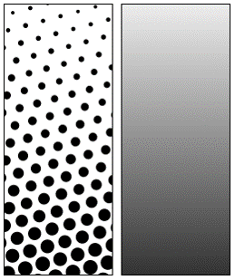
- 流行的圖片文件格式
	- **BMP**: the major system standard graphics file format for Microsoft Windows, used in Microsoft Paint and other programs. Many sub-variants within the BMP standard.
		- Windows採用的圖像文件存儲格式
		- 4 components
			- 位圖文件頭(bitmap-file header)
			- 位圖信息頭(bitmap-information header)
			- 彩色表(color table)
			- 定義位圖的字節陣列
	- **8-bit GIF**: one of the most important format because of its historical connection to the WWW and HTML markup language as the first image type recognized by net browsers.
		- **LZW**無損壓縮存儲圖像
		- 允許背景透明
		- 可在文件中存放多夫彩色圖像並製作出幻燈片或動畫效果
		- 支持圖片交叉存儲(縮略圖)
		- 可在圖像中加入文本
		- 以塊存儲
		- GIF數據流組成:
			- GIF文件頭
			- 數據塊, 數據子塊: 表示圖形/圖像
			- 控制信息塊: 顯示圖形/圖像
			- GIF文件結束塊
	- **PNG**: standing for Portable Network Graphics, meant to supersede the GIF standard, and extends it in important ways.
		- 灰度圖像深度可達16位, 彩色圖像深度可達48位
		- 從**LZ77**派生的無損壓縮算法
		- PNG數據流組成:
			- 8 bits PNG文件署名域(PNG file signature)
			- 三個以上數據塊
	- **JPEG**: currently the most important common le format.
		- 是一種連續色調, 多級灰度, 靜止圖像的數字圖像壓縮編碼方法
		- 基於離散余弦變換編碼
		- 每個像素每個分量量化為255級, 用8 bits表示
	- **TIFF**: stands for Tagged Image File Format.
	- **EXIF** (Exchange Image File): an image format for digital cameras, Compressed EXIF files use the baseline JPEG format.

### Chapter4: Fundamental Concepts in Video

- 彩色電視系統採用亮度色度信號混合傳送的方式
- 全球彩色電視標準制式
	- NTSC(**N**ational **T**elevision **S**ystems **C**ommittee)
		- 525行/幀, 30幀/秒
		- 高寬比: 4:3(電視) 3:2(電影) 16:9(高清晰度電視)
		- 隔行掃描, 2場/幀, 262.5行/場
		- 每場開始部分保留20掃描線作為控制信息, 485條線作為可視數據(Laser disc約420, S-VHS約320)
		- 彩色空間: YIQ
		- 信道帶寬: 6MHz, 亮度: 4.2MHz, 色度I:1.6MHz, Q: 0.6MHz, 色度副載頻3.58MHz
		- 美國, 加拿大, 日本, 韓國, 菲律賓和中國台灣等採用
	- PAL(**P**hase-**A**lternative **L**ine)
		- 625行/幀, 25幀/秒
		- 高寬比: 4:3
		- 隔行掃描, 2場/幀, 312.5行/場
		- 彩色空間: YUV
		- 信道帶寬: 8MHz, 亮度: 5.5MHz, 色度U, V: 各1.8MHz, 色度副載頻4.43MHz
		- 逐行倒相: 每行的色度信號與上一行倒相
		- 西歐, 中國, 印度和朝鮮等採用
		- 相對於NTSC的優勢
			- 逐行倒相可以盡可能減少相位錯誤
			- NTSC沒有顏色校正
	- SECAM(**Sé**quential **C**ouleur **A**vec **M**émoire)
		- 625行/幀, 25幀/秒
		- 高寬比: 4:3
		- 隔行掃描, 2場/幀, 312.5行/場
		- 彩色空間: YUV
		- 信道帶寬: 8MHz, 亮度: 5.5MHz, 色度U, V(交替行發送): 4.25MHz, 色度副載頻4.41MHz
- 保持兼容性
	- Three RGB signals are converted into Luminance Y, and color difference signals using simple mathematical relation.
	- Retain the same signal timings of BW(黑白電視).
- 大面積著色及高頻混合原理
	- 彩色細節失明: 人眼對黑白圖像的細節有較高的分辨力, 而對彩色圖像的細節分辨力較低.
	- 大面積著色原理: 對著色面積大的各種顏色, 對細節部分不需要顯示色度的區別.
	- 高頻混合原理: 顏色的細節部分(對應於信號的高頻部分), 可以用亮度信號取代.
- 掃描方式
	- 逐行掃描
	- 隔行掃描
- 模擬視頻傳輸信號分類
	- 分量視頻: 採用三根信號線連接視頻設備傳送信號
	- 複合視頻: 只需要一根信號線來傳送信號(亮度信號與色度信號混合)
	- S-Video: 採用稱為S端子的四芯連接器

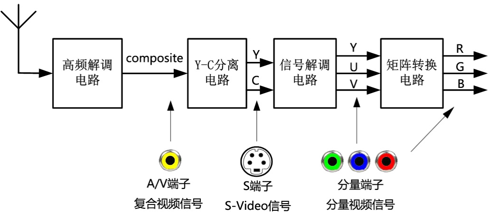
- 顏色子採樣: 對顏色信號使用的採樣頻率低於對亮度信号的採樣頻率
- 數字電視分類
	- 按圖像清晰度分類
		- HDTV
			- 垂直方向720條掃描線或更多
			- 常用: (**p**: progressive scan, **i**: interlaced scan)
				- 720p: 1280\*720p
				- 1080p: 1920\*1080p
				- 1080i: 1920\*1080i
			- 寬高比: 16:9
		- SDTV
		- LDTV
	- 按信號傳輸方式分類
		- 地面數字電視
		- 衛星數字電視
		- 有線數字電視
	- 按產品類型分類
		- 數字電視顯示器
		- 數字電視機頂盒
		- 一體化數字電視接收機
	- 按顯示屏幕幅型比分類
		- 4:3
		- 16:9

### Chapter5: Lossless Compression Algorithmns

- 無損編碼: 指使用壓縮後的數據進程數據重構(解壓縮), 得到的數據與原始數據完全相同
- 有損編碼: 重構後得到的數據與原始數據不同, 但不影響人對原始數據表達的信息造成誤解
- 壓縮比: 壓縮前數據大小/壓縮後數據大小
- 信息量: 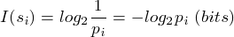, 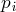為第i個事件的概率
- 熵(Entropy): 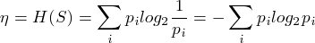, 表示信息源S中的信息量屬性, 也表示最小平均編碼位數
- 熵編碼:
	- Huffman Coding[[**more details**](./../Algorithmn/Encode/Huffman/Huffman.md)]
		- Adaptive Huffman Coding: 隨著頻率增大, 符號重新編碼
	- Arithmetic Coding[[**more details**](./../Algorithmn/Encode/Arithmetic/Arithmetic.md)]
- Run-Length Coding(RLC): 行程編碼(適用於編碼出現連續片段的信息)
	- 00000000111100000000 => 8**0**4**1**8**0**
- Dictionary-based Coding
	- LZ77
	- LZSS
	- LZ78
	- LZW[[**more details**](./../Algorithmn/Encode/LZW/LZW.md)]

### Chapter6: Lossy Compression Algorithmns

- 有損主要產生於**量化**過程
- Quantization(量化)
	- Digitization(數字化): 在AD轉換過程, 對信號幅度量化
	- Coding(編碼): 在熵編碼前, 對正交系數, 差值或預測誤差量化
- 量化器(Quantizer)設計標準 (兩標準有限制, 需要權衡)
	- 給定量化分級層數, 滿足量化誤差最小
	- 限定量化誤差, 滿足以儘量小的平均比特數, 表示量化輸出
- 量化分類:
	- 標量量化
		- 均勻標量量化 (Uniform Scalar Quantization)
		- 非均勻標量量化 (Non-uniform Scalar Quantization)
		- 自适应标量量化 (Adaptive Scalar Quantization)
	- 矢量量化
- Predictive Coding(預測編碼): 根據相關性特點考慮, 利用一個已經出現的信號對下一個信號進行預測, 得到一個預測值. 然後對實際值和預測值求差, 對這個差值信號進行編碼. (預測編碼是否有損由是否使用量化器決定)
- Predictive Coding of digital image
	- 預測類型: 
		- 一維預測(行內預測): 利用同一行上相鄰的樣值進行預測
		- 二維預測(幀內預測): 利用同一行和前面幾行的數據進行預測
		- 三維預測(幀間預測): 利用相鄰幀的樣值進行預測
	- 幀間預測編碼中視頻信號的冗餘度主要體現在空間相關性(幀內), 時間相關性(幀間)和色度相關性
	- 幀間預測編碼被廣泛應用到MPEG系列視頻壓縮標準
	- 活動補償帧間預測步驟
		- 圖像分割: 把圖像劃分為靜止的背景和若干運動的物體, 由於構成同一物體的所有像素位移相同
		- 運動矢量估值: 考察前後兩個動畫, 利用運動估值算法得到兩個物體的位移矢量
		- 運動補償: 用運動矢量補償物體的運動效果, 再進行預測
		- 編碼: 除了差值編碼外, 對位移矢量以及區域分割信息進行編碼
- Differential PCM(DPCM): 量化表需要設計
- Adaptive Differential PCM(ADPCM): 預測系數自適應調正, 量化器參數自適應調整
	- 優勢
		- 有效降低信號失真
			- 斜率過載
			- 顆粒噪聲
			- 假輪廓噪聲
			- 邊沿繁忙
- Transform Coding(變換編碼): 將原始信號經過數學上的正交變換後, 對變化系數進行量化, 編碼和傳輸
	- (Karhunen-Loève Transform)K-L變換: 可逆線性變換(去相關性好)
	- DCT(離散余弦變換): 用DCT的變換矩陣求解代替K-L的特徵向量求解, 可以節省大量計算, 廣泛應用於圖像壓縮編碼. IDCT用於重構信號
	- DFT(離散傅立葉變換)
	- FFT(快速傅立葉變換)
	- 小波(wavelet)變換

- 1D Discrete Consine Transform(DCT):

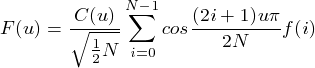

- 2D Discrete Consine Transform(DCT):

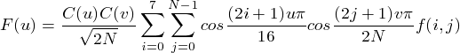

- 3D Discrete Consine Transform(DCT):

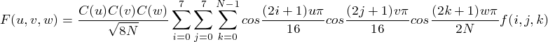

### Chapter7: Image Compression Algorithmns

- JPEG(Joint Photographic Experts Group)
- JPEG壓縮算法:
	- 採用DCT(離散余弦變換)為基礎的有損壓縮算法
	- 採用預測編碼技術為基礎的DPCM無損壓縮算法
- JPEG模式:
	- Lossless Mode: 基於DPCM的無損編碼模式(**三鄰域二維預測編碼**和**熵編碼**), 壓縮比可達2:1
	
	
	- Sequential Mode: 基於DCT的有損順序編碼模式, 壓縮比可達10:1
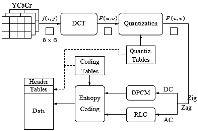

		- 核心壓縮編碼步驟:
			- 使用FDCT(Forward Discrete Cosine Transform)正向離散余弦變換把空間域表示的圖變成頻率域表示的圖.
			- 使用加權函數對DCT系數進行量化. (加權函數對於人的視覺是最佳的)
			- 對直流系數採用DPCM, 對交流系數採用RLE, 然後用Huffman或者Arithmetic進行熵編碼.
		- 量化: JPEG採用均勻量化器進行量化, 由於人眼對亮度信號比對色差信號更敏感, 因此採用兩種根據心理學視覺加權函數得到的量化表
			- 亮度量化值
			- 色差量化值
	- Progressive Mode: 基於DCT的遞增編碼模式
		- 模式與Sequential Mode相似, 不同之處在於編碼要經過多次掃描, 每次掃描的粗糙程度不一樣
		- 分類:
			- Spectral Selection: 按頻段遞增
			- Successive Approximation: 按位遞增
	- Hierarchical Mode: 基於DCT的分層編碼模式
	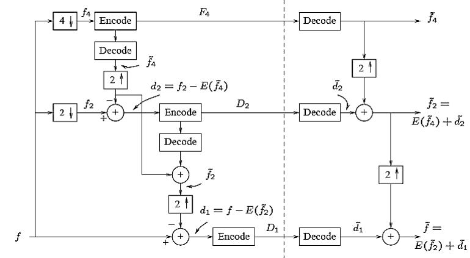
		- 步驟:
			1. 降低原始圖像的空間分辨率
			2. 對已降低分辨率的圖像按照順序編碼進行壓縮存儲
			3. 對低分辨率圖像解碼, 用**插值法**提高圖像分辨率
			4. 對高分辨率圖像, 把原圖像的預測值跟原圖像進行差值運算, 然後基於DCT編碼
			5. 反復c, d
- JPEG2000 Standard
	- 編碼方式
		- DCT-based
		- wavelet-based
	- JPEG2000可以處理多達256個通道的信息, 而JPEG只能處理三個顏色通道
- JPEG-LS Standard
	- 該標準主要特點是減低複雜度
- JBIG(Joint Bi-level Image Processing Group)
	- 該標準為了允許用電子錶處理文檔
	- 無損壓縮
	- JBIG-2提出了基於模型的編碼方式

### Chapter8: Basic Audio Compression Techniques

- 聲音編碼方式
	- Waveform Coding: 基於音頻數據的統計特性進行編碼, 直接對波形信號進行採樣和量化
		- 脈衝編碼調製(PCM)
		- 增量調製(DM)
		- 自適應脈衝編碼調製(APCM)
		- 差分脈衝編碼調製(DPCM)
		- 自適應差分脉冲編碼調製(ADPCM)
	- Source Coding: 基於話音的聲學參數進行編碼, 提取話音生成模型的參數, 進行編碼
	- Hybrid Coding: 綜合上述兩種編碼技術
	- Perceptual Coding: 基於人的聽覺特性進行編碼
- 兩種基於對數關係的非均勻量化方法
	- μ律壓擴法: 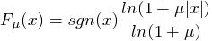 , μ一般取值100或255
	- A律壓擴法: 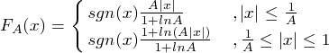 , A一般取值87.6
- DM(ΔM), 增量調製: 是一種預測編碼技術, 當Δ>0時, 上升; 當Δ<0時, 下降.
- ADM, 自適應增量調製: 自動調整量化階Δ的大小
	- 調整方法:
		- 前向自適應: 根據量化樣本值的均方根來估計
		- 後向自適應: 根據過去樣本, 提取量化階信息
	- APCM(自適應脈衝編碼調製): 根據輸入信號的幅度大小來調整量化階
	- DPCM(差分脈衝編碼調製): 根據過去的樣本去估算下一個樣本信號的幅度大小
	- ADPCM: 綜合了APCM和DPCM
- 話音(Voice)的形成: 肺中空氣受到擠壓形成氣流, 通過聲帶沿著聲道釋放出去, 從而形成**話音**
	- 濁音: 聲道打開, 聲帶再先打開後關閉, 氣流經過使聲帶發生張弛振動, 變為准週期震動氣流 (其激勵源可等效為准周期的脈衝信號)
	- 清音: 聲帶不振動, 而在某處保持收縮, 氣流在聲道裏收縮後告訴通過產生湍流, 再經過主聲道的調整形成 (其激勵源可等效為一種白噪聲信號)
	- 爆破音: 聲道關閉之後產生壓縮空氣, 然後突然打開聲道形成
- 相位不敏感特性: 只要能量頻譜分佈正確, 無須擔心波形的確切形式
- 聲音質量:
	- 廣播質量: 帶寬為7000Hz的中等質量話音
	- 長途電話質量: 帶寬為3400Hz, 信噪比為30db, 有失真
	- 通信質量: 完全可以聽懂, 但與長途電話質量相比有明顯失真
	- 合成質量: 80%~90%的可懂度, 聽起來像機器聲音, 失去講話者的特徵
- 聲音冗餘:
	- 幅度非均勻分佈
	- 樣本之間相關性
	- 週期之間相關性
	- 基音之間相關性
	- 靜止系數(話音間隙)
	- 長期相關性
- 通道聲音合成器(Channel Vocodor): 使用一組濾波器將信號分解為不同的頻率分量, 同時進行分析, 以決定音調和語音的激勵源. 它產生一個描述聲音模型的激勵參數向量.
- 共振峰聲碼器(Format Vocodor): 語音中部分頻率強度較大, 稱為重要頻率(共振峰).
- 線性預測編碼(LPC): 通過分析話音波形來產生聲道激勵和轉移函數的參數, 然後對參數進行編碼.
- 碼激勵線性預測(CELP): 試圖通過複雜的激勵描述機制來彌補簡單的LPC模型在語音質量上的缺陷. 首先使用一個完整的激勵向量集合, 即一個碼本, 和真實語音匹配, 然後把最佳匹配項序號發送出去.
- 混合激勵合成器(Hybrid Excitation Vocoder)
	- MBE(Multi-Band Excitation)
	- MELP(Multi-Band Excitation Linear Predictive)
- MPEG音頻壓縮: 沿用心理測量(Psychoacoustics)模型的優點, 構建一個大的多維查找表, 用很少的位數來傳送掩蔽的頻率部分
	- Auditory Masking(聲音掩蔽效應): 一部分聲音阻礙聽覺系統感受另一部分聲音的現象
	- Psychoacoustics
		- (Equal-Loudness Relations)等響度關係
		- (Frequency Masking)頻率掩蔽效應
		- (Temporal Masking)時間掩蔽效應
	- MPEG-1: 先對輸入應用一個濾波器組, 把輸入分解得到頻率成分, 同時對數據應用心理聲學模型, 用於位分配塊; 使用被分配的位數, 量化從濾波器組得到的信息.
		- 採用**感知子帶**編碼: 
			- 將音頻信號用濾波器分成32個子帶
			- 用FFT將子帶變換到頻率域
			- 根據心理聲學模型估計各個子帶的感知閾值
			- 根據對感知閾值的估計, 對各個子帶進行比特分配和量化
		- MPEG-1音頻使用3個向下兼容的音頻壓縮層
			- Layer1: 子帶是頻帶相等的子帶, 其心理聲學模型僅使用頻域掩蔽特性. 主要用於小型數字盒式磁帶(digital compact cassette, DCC), 採用192kbps.
			- Layer2: 除了使用頻域掩蔽特性, 還利用時間掩蔽特性, 並且在低, 中和高頻段對比特分配作了一些限制. 其應用包括數字廣播聲音(digital broadcast audio, DBA), CD-I(compact disc-interactive), 數字音樂和VCD(video compact disc)等.
			- Layer3: 使用臨界頻帶濾波器, 把聲音頻帶分成非等寬帶的子帶, 心理聲學模型除了使用頻域掩蔽特性和時間掩蔽特性外, 還考慮到立體聲數據的冗餘, 編碼方面使用到Huffman Coding.
			- 層數越高, 心理声学模型應用更複雜
			- 層數越高, 壓縮質量更好
			- MP3壓縮性能:
			
	- MPEG-2
		- BC Audo標準與MPEG-1標準相同
		- 三層壓縮層與MPEG-1標準相同
		- 擴充部分:
			- 增加了16kHz, 22.05kHz和24kHz的採樣頻率
			- 擴展了編碼器的輸出速率範圍, 由32~328kbps到8~640kbps		
			- 增加了聲道數, 支持5.1聲道和7.1聲道的環繞聲
			- 支持Liner PCM和Dolby AC-3編碼
		- AAC(Advanced Audio Coding)標準
	- MPEG-4
		- 將多種不同音頻成分整合成一種標準: 語音壓縮, 基於感知的編碼器, 文語轉換, MIDI.
		- 可集成從話音到高質量的多通道聲音, 從自然聲音到合成聲音, 編碼方式還包括參數編碼(parametric coding), 碼激勵線性預測(code excited linear predictive)編碼, 時間/頻率編碼, 結構化聲音(structed audio)編碼和文本-語音TTS(text-to-speech)系統的合成聲音等
- 音頻壓縮標準(Audio Compression Standards)
	- G711: Pulse Code Modulation (PCM) of Voice Frequencies
	- G722: 7 kHz Audio Coding within 64 kbit/s 
	- G723.1: Dual Rate Speech Coder for Multimedia TelecommunicationTransmitting at 5.3 & 6.3 kbit/s 
	- G725: System Aspect for the Use of the 7 kHz Audio Codec within 64 kbit/s 
	- G726: 40, 32, 24, 16 kbit/s adaptive differential pulse code modulation (ADPCM) 
	- G727: 5-,4-,3-,and 2-bits/sample embedded adaptive differential pulse code modulation 
	- G728: Coding of Speech at 16 kbit/s Using Low-Delay Code Excited Linear Prediction (LD-CELP) 
	- G729: Coding of Speech at 8kbit/s using Conjugate-Structure Algebraic-Code-Excited Linear Prediction(CS-ACELP) 
	- G764: Voice Packetization - Packetized Voice Protocol 
	- MPEG Audio
	- ...
- GSM(Global System for Moble communications, 全球數字移動通信系統)音頻編碼, 用於數字蜂窩電話通信協議.

### Chapter9: Basic Video Compression Techniques

- 視頻是由時間上連續的一系列幀(圖像)組成
- 解決視頻壓縮的可行方法: 基於前面的幀進行預測編碼, 首先按順序提取圖像, 然後進行預測, 最後對差值進行編碼
- 運動補償: 由於幀間圖像差別由攝像頭或物體運動造成, 因此可以通過在這些幀裏探測相應像素或區域的移動, 並測量其差值來進行運動補償
	- 運動估計(查找運動矢量)
	- 基於運動補償的預測
	- 預測誤差生成
- 宏塊: 每幀圖像分成大小為N*N的宏塊
- 運動矢量: 參考宏塊到目標宏塊的位移
	- 其求解是一個**匹配**問題, 即相關性判定問題
	- 由於矢量搜索計算複雜度較高, 因此限制在一個較小的相鄰區域內進行
	- 獲取一個宏塊的運動矢量複雜度為: 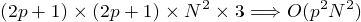
	- 2D Logarithmic Search(二維對數搜索)複雜度為 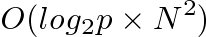
- 基於運動補償的壓縮編碼, 只需要對運動矢量和差值宏塊編碼
- 數字視(音)頻編解碼標準
	- H.26x系列 (ITU標準)
		- H.261
			- 冗餘降低策略:
				- 利用二維DCT減少圖像的空間域冗餘度
				- 利用運動補償預測減少圖像的時間域冗餘度
				- 利用視覺加權量化減少圖像的"感知域"冗餘度
				- 利用熵編碼來減少圖像的"統計域"冗餘度
			- 信源編碼算法:
				- 將預測誤差或輸入圖像劃分為8\*8的像素塊, 然後將四個亮度像素塊和兩個在空間位置上與之重疊的色差像素塊符合成一個16\*16的宏塊
				- 對於幀序列的第一副圖像, 採用幀內變換編碼
				- 幀間預測採用混合方法
			- 定義了兩種類型的幀
				- **I**幀
				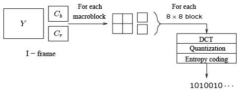
				- **P**幀
				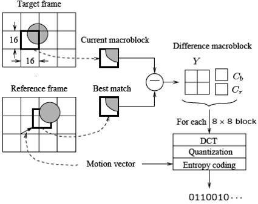
	- MPEG系列 (ISO/IEC標準)
		- MPEG-1: 低於1.5Mb/s的數字化運動圖像及伴音編碼(1992)
			- MPEG-1標準只支持非交錯式視頻
			- MPEG-1系統: 規定電視圖像數據, 聲音數據及其他相關數據的同步
			- MPEG-1視頻: 規定電視數據的編碼和解碼
			- MPEG-1音頻: 規定聲音數據的編碼的解碼
			- MPEG-1一致性測試: 說明如何測試比特數據流和幾碼是否滿足MPEG-1規定
			- MPEG-1軟件模擬
			- **I**幀: 內幀
			
			- **P**幀: 單向預測幀
			
			- **B**幀: 雙向預測幀
			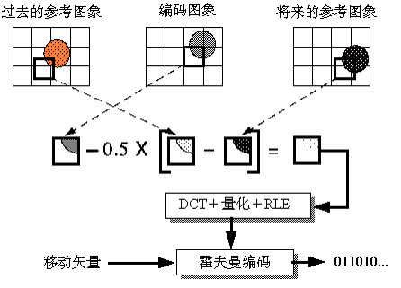
		- MPEG-2: 運動圖像及伴音通用編碼(1994)
			- MPEG-3: 合併到HDTV(1992)
		- MPEG-4: 甚低速率音視頻編碼(1999)
		- MPEG-7: 多媒體內容描述接口標準(2001)
		- MPEG-21: 多媒體應用框架標準(2003)
			- 規定大範圍的網絡及設備中的多媒體定義, 標識, 描述, 管理及保護等.
		- MPEG-A: A suite of standards specifying application formats that involve multiple MPEG and, where required, non MPEG standards(2007)
		- MPEG-B: MPEG systems technologies. (ISO/IEC 23001) (e.g., Binary MPEG format for XML, Fragment Request Units, BSDL and others)(2006)
		- MPEG-C: MPEG video technologies. (ISO/IEC 23002) (e.g., Accuracy requirements for implementation of integer-output 8x8 inverse discrete cosine transform and others)(2006)
		- MPEG-D: MPEG audio technologies. (ISO/IEC 23003) (e.g., MPEG Surround, SAOC-Spatial Audio Object Coding and USAC-Unified Speech and Audio Coding)(2007)
		- MPEG-E: Multimedia Middleware. (ISO/IEC 23004) (a.k.a. M3W) (e.g., Architecture, Multimedia application programming interface (API), Component model and others)(2007)
		- MPEG-V: Media context and control. (ISO/IEC 23005) (a.k.a. Information exchange with Virtual Worlds) (e.g., Avatar characteristics, Sensor information, Architecture and others)(2011)
		- MPEG-M: MPEG eXtensible Middleware (MXM). (ISO/IEC 23006) (e.g., MXM architecture and technologies, API, MPEG extensible middleware (MXM) protocols)(2010)
		- MPEG-U: Rich media user interfaces. (ISO/IEC 23007) (e.g., Widgets)(2010)
		- MPEG-H: High Efficiency Coding and Media Delivery in Heterogeneous Environments. (ISO/IEC 23008) Part 1 – MPEG Media Transport; Part 2 – High Efficiency Video Coding; Part 3 – 3D Audio.(2013)
		- MPEG-DASH: Information technology – Dynamic adaptive streaming over HTTP (DASH). (ISO/IEC 23009) Part 1 – Media presentation description and segment formats(2012)
	- AVS (中國標準)
	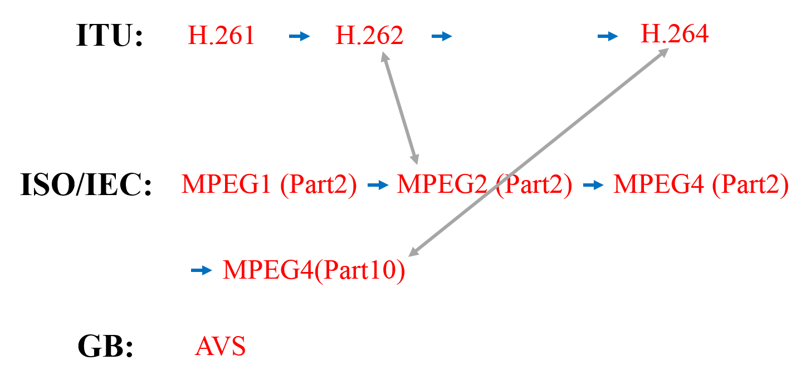

### Chapter10: Visual Coding in MPEG-4, Other MPEG Standards

### Chapter11: Computer and Multimedia Networks

### Chapter12: Multimedia Communication

=====

