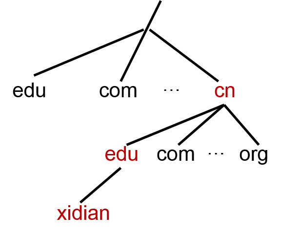

## DNS (Domain Name System)	[Back](./../Application.md)
- 作用: IP地址的別名, 便於記憶
- 結構: 域名層次樹



- 存放: 域名服務器
	- 存放域名和IP的對應記錄
	- 提供域名查詢功能

### 域名訪問

- 域名與IP的互相轉換
 
####1. 域名到IP的轉換
- 對同一個DNS服務器兩次調用所返回的IP地址列表順序有可能不同.
- 在不同的DNS服務器上查詢, 返回結果不同.
- 查詢失敗時, 可以通過hstrerror()查找h_errno的信息.
- 由於查詢是**逐級的**, 建議採用多進程(線程)來縮短時間消耗.

#####method
```c
struct hostent* gethostbyname(const char* name)

/* hostent */
struct hostent
{
	char h_name;	//host name
	char** h_aliases;	//alias list, with NULL ends
	int h_addrtype;	//types of host address: AF_INET
	int h_length;	//length of host address: 32 bits
	char** h_addr_list;	//host address list, with NULL ends
}
```

#####parameters
- name: 域名

####2. IP到域名的轉換
#####method
```c
struct hostent* gethostbyaddr(const char* addr, size_t len, int family)

/* hostent */
struct hostent
{
	char h_name;	//host name
	char** h_aliases;	//alias list, with NULL ends
	int h_addrtype;	//types of host address: AF_INET
	int h_length;	//length of host address: 32 bits
	char** h_addr_list;	//host address list, with NULL ends
}
```

#####parameters
- addr: 地址
- len: 地址長度
- family: 地址的協議簇
