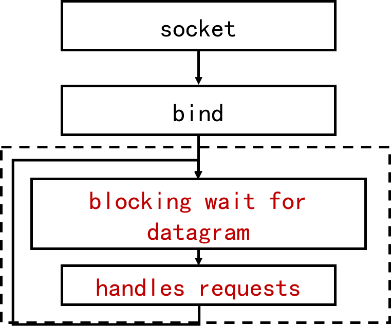
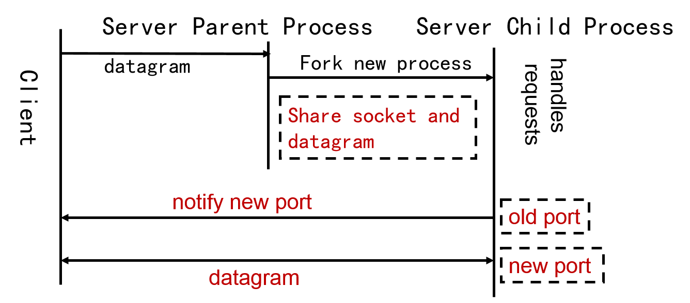
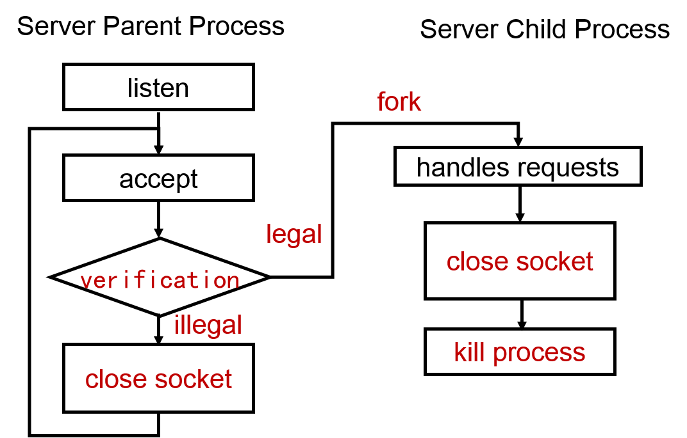
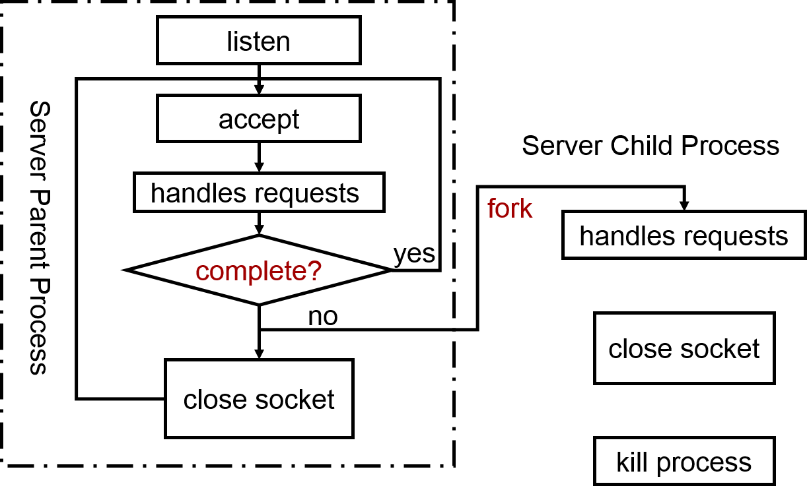

## Model of Server [Back](./../Coding.md)

- 服務器分類:
	- 循環服務器: 同一時刻只能處理一個客戶端請求
	- 併發服務器: 同一時刻可處理多個客戶端請求
	- UDP/TCP服務器模型: 
		- UDP: 採用**循环服务器**模型
		- TCP: 採用**併發服務器**模型

### 1. 循環服務器

- 每次循環執行一次客戶端請求
- 當請求未處理完的情況下, 將會阻塞其他客戶端的請求
- 優點: 結構簡單, 消耗代價較少
- 缺點: 當處理請求多的時候, 將導致處理效率低下.

##### 1.1 TCP


##### 1.2 UDP



### 2. 併發服務器

##### 2.1 UDP

###### 2.1.1 Model 1: one datagram of requests

- 用於**客戶請求需要較長處理時間**且**客戶發送時間大於服務器處理速度**的情況
- 避免因接收緩衝區滿而導致數據報丟失


###### 2.1.2 Model 2: more than one datagram of requests



##### 2.2 TCP

###### 2.2.1 Model 1: one child process for one client

- 一個子進程對應一個客戶端, 而父進程負責監聽並創建子進程
- 創建子進程開銷較大, 適合處理時間長的客戶請求. 如FTP傳輸
- 客戶端多, 請求處理時間短時會降低該模型效率. 如HTTP服務器



###### 2.2.2 Model 2: defer create processes

- 讓父進程先處理客戶端請求, 若父進程處理完則繼續處理, 若未處理完則新建子進程來另外處理.
- 循環服務器與併發服務器混合模型
- 動態創建進程以減少創建開銷
	- 建立進程表項的開銷
	- 創建數據段和堆棧段的開銷



###### 2.2.3 Model 3: precreate processes (fixed number)

- 通過預先創建進程來提高用戶體驗度, 即對於客戶端而言, 請求時減少了新建進程的時間等待.
- 子進程進行accept, 無連接則睡眠
- 優點: 響應時間快
- 缺點: 需要預先估計創建進程的數量, 若多了則浪費系統資源, 少了則導致客戶端等待.


###### 2.2.4 Model 4: precreate processes (fixed number and transmit socket)

- 父進程進行accept, 並把socket傳遞給子進程


###### 2.2.5 Model 5: precreate processes (adapted number)

- 由於固定數量存在估計缺點, 那麼通過設置**軟閾值**來控制進程數便可自適應調節.


###### 2.2.6 Model 6: multiplex

```c
int select(int maxfd, fd_set* rdset, fd_set* wrset, fd_et* exset, struct timeval* timeout);
```

- 在測試可讀描述符集合rdset中, 同時包含偵聽socket和已連接socket
- 在測試可寫描述符集合wrset中, 同時包含已連接socket
- 通過多路複用IO來完成併發, 要求所有的socket描述符都設置為非阻塞方式.
- 過程:
	1. 設置讀寫描述符集合, 其中讀描述符集合包括偵聽socket
	2. 調用select測試socket描述符是否就緒
	3. 偵聽socket就緒則接受新連接
	4. 其他socket就緒則執行讀寫操作
	5. 重複前四個步驟
- 優點: 只需要一個進程處理所有客戶端的請求, 而沒有創建和管理進程的開銷
- 缺點: 服務器必須依次處理所有請求, 編程較為複雜
- 適用於請求多但處理時間短的服務器
