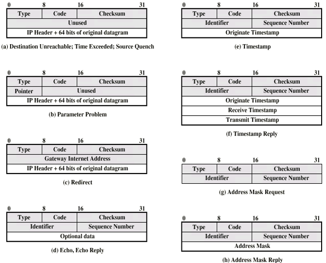

## Original Socket Coding [Back](./../socket.md)
- write a new **higher-level** transport protocol based on **IP protocol**

### 1. Create original socket

##### method
```c
int socket(int family, int type, int protocol)
```

##### parameters
- family: AF_INET
- type: SOCK_RAW
- protocol:
	- IPPROTO_ICMP: ICMP數據包
	- IPPROTO_IGMP: IGMP數據包
	- IPPROTO_IP: IP數據包

##### return value
- \>=0: success
- -1: failure

### 2. Set IP options
- set whether automatically fill the IP header

```c
int on = 1;
setsockopt(sockfd, IPPROTO_IP, IP_HDRINCL, &on, sizeof(on));
```

- on=0: 由協議自動填充
- on=1: 用戶程序填充

### 3. Bind
- if **IP_HDRINCL** has been set, ```bind()``` takes no effect, and you must fill each IP datagram by yourself
- local bind: ```bind()```
- opposite bind: ```connect()```

### 4. Send or Receive
##### send
- if you has not called ```connect()``` to bind, you must use ```sento()``` or ```sendmsg()```  to send data
- if you has called, then ```write()``` or ```send()``` is allowed to use

##### receive
- data from **UDP** and **TCP** won't be sent to original socket
- receive data from **ICMP**
	- **echo** response
	- **timestamp** response
	- **mask** response
	- ...
	
- receive data from other types of protocols
- receive data which cannot be recognized by the **Kernel**
	
