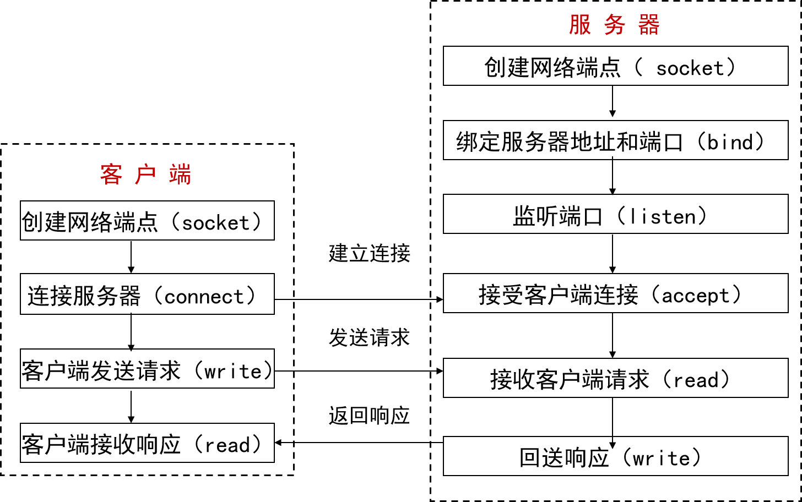

## Overview	[Back](./../Network.md)
- 網絡編程模型
	- B/S 模型

	- C/S模型

- 互聯網普遍使用大端模式(big-endian)
	- little-endian(小端): 低地址放低位
	- big-endian(大端): 低地址放高位 
- Communication Protocol Layers(網絡通信協議層)(自下而上serve to; 自頂向下serve by)
	- Applicaons Layer(應用層)
		- Applications(應用層)
		- Sessions(會話層)
		- Presentations(表現層)
	- Transport Layer(傳輸層)
		- TCP: 面向有鏈接
		- UDP: 面向無鏈接
	- Network Layer(網絡層)
	- DataLink Layer(數據鏈路層)
		- MAC
		- LLC
	- Physical Layer(物理層)

=====

