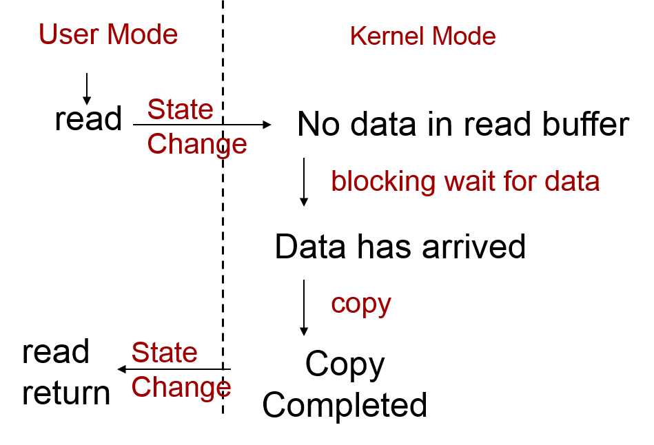
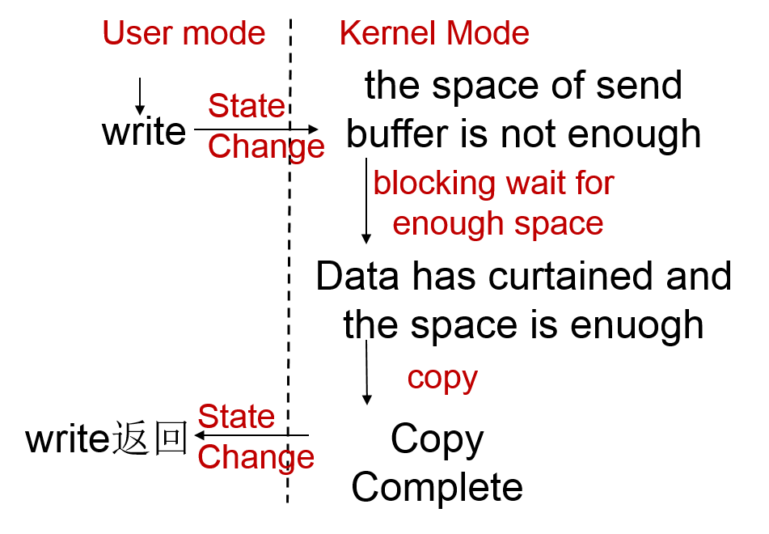
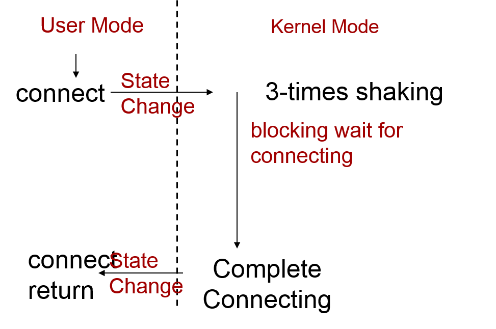
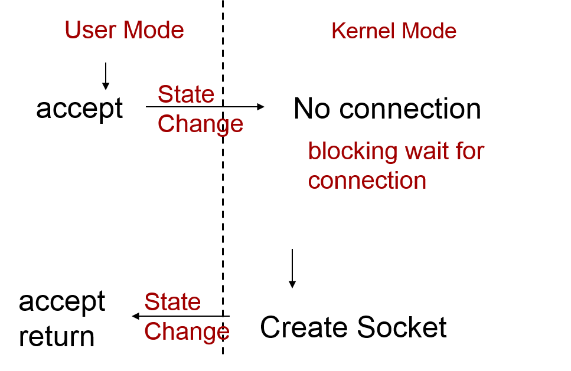
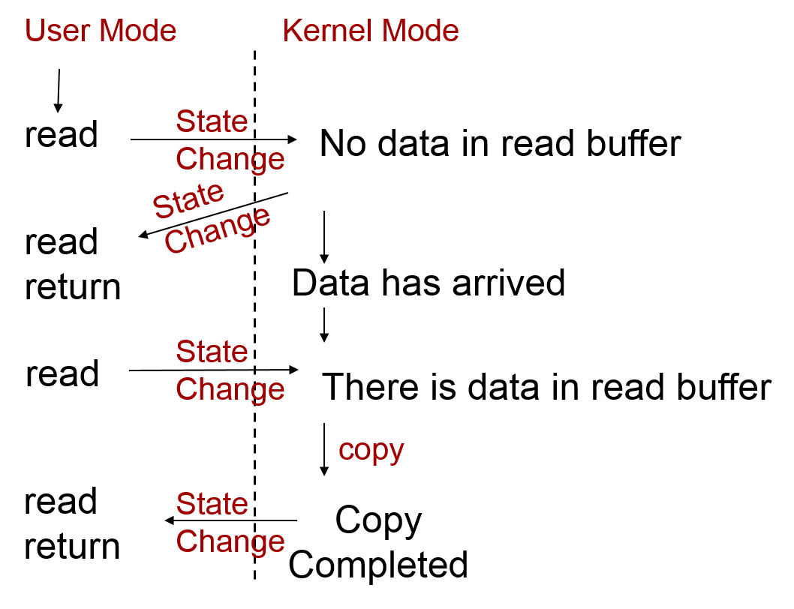
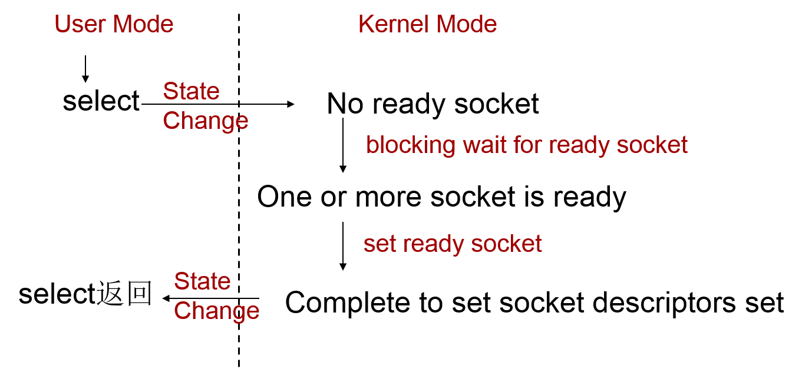
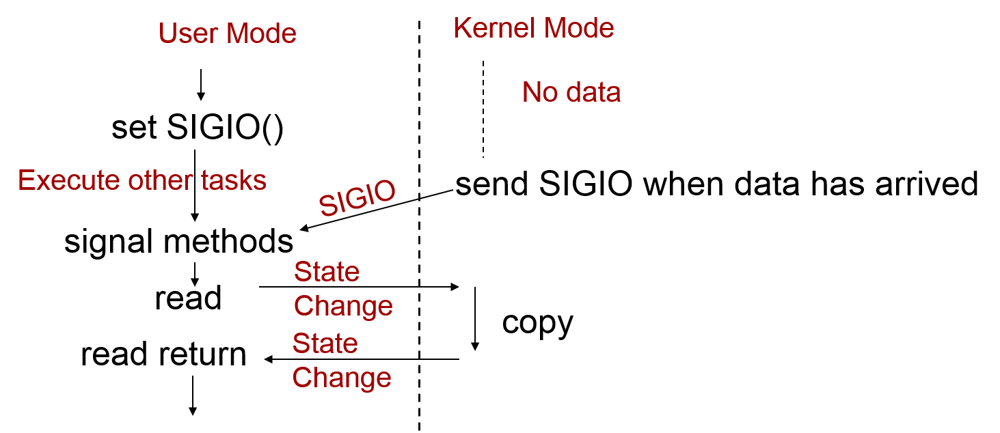

## IO(輸入/輸出)	[Back](./../OS.md)

- Linux系統下**I/O模型**:
	- 阻塞式I/O
	- 非阻塞式I/O
	- 多路複用I/O
	- 信號驅動I/O

### 1. 阻塞式IO

- 優點: 結構簡單, 容易同步
- 缺點: 阻塞導致CPU資源浪費
- 通過調用```alarm()```來進行超時控制
	- 超時到達時產生SIGALARM信號中斷阻塞
	- 多次調用時則無法區分SIGALARM信號是哪一次超時引發, 從而導致無法實現超時控制
- 通過設置socket選項進行超時控制
	- 設置SO_RCVTIMEO和SO_SNDTIMEO
	- 只需設置一次, 對後來的讀寫操作均有效
	- 不適用於accept和connect

##### 1.1 Read
 


- 產生阻塞的函數:
	- ```read()```
	- ```readv()```
	- ```recv()```
	- ```recvfrom()```
	- ```recvmsg()```

- 進程喚醒的狀態:
	- TCP以**字節**為單位, 只要接收緩衝區出現數據則喚醒
	- UDP以**數據報**為單位, 當完整的數據報到達才喚醒

##### 1.2 Write



- 產生阻塞的函數:
	- ```write()```
	- ```writev()```
	- ```send()```
	- ```sendto()```
	- ```sendmsg()```

- UDP協議寫操作永遠不會阻塞

##### 1.3 Connect



- 產生阻塞的函數:
	- ```connect()```

- TCP下, Client收到Server的SYN字段則表示```connect()```成功.
- TCP連接操作至少需要一個往返時間
- UDP沒有連接, 故不產生阻塞

##### 1.4 Accpet



- 產生阻塞的函數:
	- ```accept()```

### 2. 非阻塞式IO

- 優點: 效率提高, 不會產生阻塞
- 缺點: 長期佔用CPU



- 設置socket為非阻塞方式
	- ```fcntl()```
	
	```c
	int flags;
	flag = fcntl(sockfd, F_GETFL, 0);
	fcntl(sockfd, F_SETFL, flag| O_NONBLOCK);
	```
	- ```ioctl```
	
	```c
	int on = 1;
	ioctl(sockfd, FIONBIO, &on);
	```
- return **ERROR**
	- ```read()```: EWOULDBLOCK
	- ```write()```: EWOULDBLOCK(無空間), 空間不夠則返回實際拷貝字節
	- ```connect()```: EINPROGRESS(啟動三次握手後立即返回), 同一主機上鏈接則立即返回成功
	- ```accept()```: EWOULDBLOCK(沒有鏈接立即返回)

- 檢查操作是否完成
	- 輪詢

	```c
	for(;;)
	{
		if(read(sockfd, buf, nbytes) < 0)
		{
			if(errno == EWOULDBLOCK) continue;
			else
			{
				printf("read error\n");
				break;
			}
		}
		else
			break;	//read complete
	}
	```	

	- ```select()```
	
	```c
	// set the descriptors set for monitoring
	//...
	select(reset, wrset, exset, ...)
	//read, write ...
	//...
	```

### 3. 多路服用IO

- 只檢查一個socket描述符時和阻塞式IO模型類似, 效率低於阻塞式.
- 檢查多個socket描述符效率則高於阻塞式IO.



- socket描述符就緒的條件:
	- 讀就緒條件:
		- 接收緩衝區中數據量大於等於接受最低限度(默認接受最低限度是1: TCP為1個字節;UDP為1個數據報. 可通過SO_RCVLOWAT修改)
		- 讀通道被關閉, 收到FIN字段
		- 偵聽socket的完成鏈接隊列不為空
		- 非阻塞式socket的connect操作過程出現錯誤
	- 寫就緒條件:
		- 發送緩衝區可用空間大於等於發送最低限度(TCP默認發送最低限度是2048字節, UDP沒有實際的發送緩衝區, 因此總是写就绪. 可通過SO_SNDLOWAT修改)
	- 異常就緒條件(用於帶外數據)

### 4. 信號驅動IO

- 非阻塞等待IO
- 程序結構簡單, 更適用於UDP協議, 因為TCP在**很多環節**會產生SIGIO信號, 從而產生混淆, 而UDP只在**收到數據報或錯誤**時產生SIGIO信號.



- 設置步驟:
	- 1. 設置SIGIO
	
	```c
	void sigio_handler(int signo)
	{
		//...
	}
	```

	```c
	int sockfd;
	int on = 1;
	signal(SIGIO, sigio_handler);
	```
	
	- 2. 設置socket描述符所有者

	```c
	fcntl(sockfd, F_SETOWN, getpid());
	```

	- 3. 允許socket進行信號驅動IO

	```c
	ioctl(sockfd, FIOASYNC, &on);
	```
