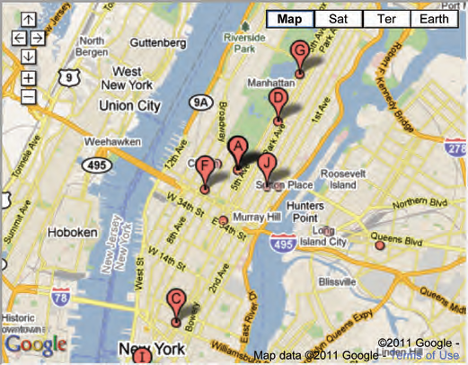

## Extra Markup [Back](./../HTML.md)

### 1. Evolution

- **HTML4**: released in 1997
	- Some elements which are not suggested to use(can be achived with **CSS**)
		- ```<center>``` for centering content on a page
		- ```<font>``` for controlling the appearence of text
		- ```<strike>``` for putting a line through the text
- **XHTML 1.0**: released in 2000
	- To follow the rules of XML
	- Some rules to obey:
		- every element need a **closing tag** like ``````
		- attribute names have to be in **lowercase**
		- all attributes required **a value**, which is placed in double quotes
		- every element that was opened inside another element should be closed inside the same element
	- 3 versions:
		- **Strict XHTML 1.0**
		- **Transitional XHTML 1.0**
		- **XHTML 1.0 Frameset**
- **HTML5**: released in 2000

### 2. DOCTYPES

- **DOCTYPE** must be used to tell a browser which version of HTML the page is using.
- **DOCTYPE** can also help the browser to render a page correctly.
	- HTML5

	```html
<!DOCTYPE html>
```
	- HTML4
	
	```html
<!DOCTYPE html PUBLIC "-//W3C//DTD HTML 4.01 Transitional//EN" "http://www.w3.org/TR/html4/loose.dtd">
```

	- Transitional XHTML 1.0

	```html
<!DOCTYPE html PUBLIC "-//W3C//DTD XHTML 1.0 Transitional//EN" "http://www.w3.org/TR/xhtml1/DTD/xhtml1-transitional.dtd">
```

	- Strict XHTML 1.0

	```html
<!DOCTYPE html PUBLIC "-//W3C//DTD XHTML 1.0 Strict//EN" "http://www.w3.org/TR/xhtml1/DTD/xhtml1-strict.dtd">
```

	- XML Declaration
	
	```html
<?xml version="1.0" ?>
```

### 3. Comment

- ```<!--Comment-->``` is used to add comments in the code.

### 4. Id & Class

- attribute **id** is used to uniquely identify the element from other elemnts on the page. In additional, it can be styled differently than any other instance of the same element by CSS.
- attribute **class**  is used to identify several elements from other elements on the page.
	
```html
<!-- both have the properties of the class named importance -->
<p class="important">For a one-year period from November 2010, the Marugame Genichiro-Inokuma Museum of Contemporary Art (MIMOCA) will host a cycle of four Hiroshi Sugimoto exhibitions.</p>
<p>Each will showcase works by the artist thematically contextualized under the headings "Science," "Architecture," "History" and "Religion" so as to present a comprehensive panorama of the artist's oeuvre.</p>
<p class="important admittance">Hours: 10:00 – 18:00 (No admittance after 17:30)</p>
```

### 5. Block & Inline Elements

- **Block Elements** means that the element will appear to start a new line like ```<h1>```, ```<p>```, ```<u1>``` and ```<li>```.
- **Inline Elements** means that the element will appear to continue on the same line like ```<em>```, ```<b>``` and ``````.

### 6. Grouping

- ```<div>``` allows you to gropu a set of elements together in one block-level box.
- ```<span>``` acts like an inline equivalent of the ```<div>``` and is used to contain a section of text, or to contain a number of inline elements.

### 7. IFrames

- ```<iframe>``` is used to cut a little window in your page and see another page on this window.
- attributes **scrolling** is only supported in HTML4 and XHTML, for indicating whether the iframe should have scrollbars or not.
- attributes **frameborder** is only supported in HMTL4 and XHTML, for indicating whether the frame should have a border or not.
- attributes **seamless** is come in HTML5, for indicating that scrollbars is not desired in the iframe. 

```html
<iframe width="450" height="350" src="http://maps.google.co.uk/maps?q=moma+new+york&amp;output=embed">
</iframe>
```



### 8. Information about the page

- ```<meta>``` lives inside ```<head>`` to contain information about the page.
- attribute **name** is set as 'description' to contain the description of the page.
- attribute **name** is set as 'keywords' to contain a list of keywords of the page.
- attribute **name** is set as 'robots' to indicate whether search engines should add this page to their search results or not.
- attribute **httl-equiv** is set as 'author' to define the author of the web page.
- attribute **httl-equiv** is set as 'pragma' to prevent the browser from caching the page.
- attribute **httl-equiv** is set as 'expires' to indicate when the page should expire and no longer be cached.

```html
<head>
	<title>Information About Your Pages</title>
	<meta name="description" content="An Essay on Installation Art" />
	<meta name="keywords" content="installation, art, opinion" />
	<meta name="robots" content="nofollow" />
	<meta http-equiv="author" content="Jon Duckett" />
	<meta http-equiv="pragma" content="no-cache" />
	<meta http-equiv="expires" content="Fri, 04 Apr 2014 23:59:59 GMT" />
</head>
```

### 9. Escape Characters(轉義字符)

<table>
	<thead>
		<th> </th>
		<th> name </th>
		<th> escape character </th>
	</thead>
	<tbody>
		<tr>
			<td>&#60</td>
			<td>Less-than sign</td>
			<td><&lt>, ```&#60```</td>
		</tr>
	<tbody>
</table>

<a href="#" style="left:200px;"></a>
=====
<a href="http://aleen42.github.io/" target="_blank" ></a>
