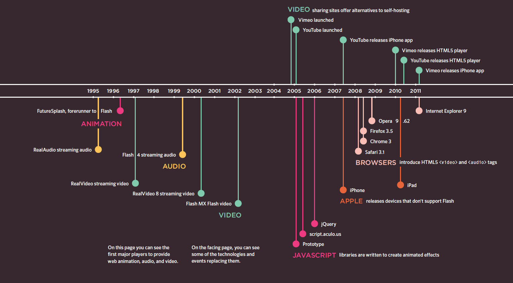

## Flash, Video and Audio [Back](./../HTML.md)

- Timeline of Flash, Video and Audio:
- Browsers that support the HTML5 elements do not all support the same video and audio formats, so you need to supply your files in different formats to ensure that everyone can see/hear them.



### 1. Flash

- Flash allows you to add animations, v XX ideo and audio to the web.
- Flash is not supported on iPhone or iPad.

###### 1.1 Add a flash movie

- **.fla** file should be converted into **.swf** file used by HTML.
- to view Flash, browsers need to use a plguin called the **Flash Player**.
- add a flash movie (**Animation**)

```html
<!DOCTYPE html>
<html>
	<head>
		<title>Adding a Flash Movie</title>
		<script type="text/javascript" src="http://ajax.googleapis.com/ajax/libs/swfobject/2.2/swfobject.js"></script>
		<script type="text/javascript">
			swfobject.embedSWF("flash/bird.swf","bird", "400", "300", "8.0.0");
		</script>
	</head>
	<body>
		<div id="bird"><p>An animation of a bird taking a shower</p></div>
	</body>
</html>
```

###### 1.2 Add a flash video

- steps for adding a Flash Video to the web page:
	- 1. Convert the video into **.flv** format
	- 2. Find an FLV player to play the video
	- 3. include the player and video in the web page
- add a flash video (**Video**)

```html
<!DOCTYPE html>
<html>
	<head>
		<title>Adding a Flash Video</title>
		<script type="text/javascript" src="http://ajax.googleapis.com/ajax/libs/swfobject/2.2/swfobject.js"></script>
		<script type="text/javascript">
			var flashvars = {};
			var params = {movie:"../video/puppy.flv"};
			swfobject.embedSWF("flash/splayer.swf", "snow", "400", "320", "8.0.0",
			flashvars, params);
		</script>
	</head>
	<body>
		<div id="snow"><p>A video of a puppy playing in
the snow</p></div>
	</body>
</html>
```

###### 1.3 Add a flash mp3 player

```html
<!DOCTYPE html>
<html>
	<head>
		<title>Adding a Flash MP3 Player</title>
		<script type="text/javascript"
src="http://ajax.googleapis.com/ajax/libs/swfobject/2.2/swfobject.js"></script>
		<script type="text/javascript">
			var flashvars = {};
			var params = {mp3: "audio/test-audio.mp3"};
			swfobject.embedSWF("flash/player_mp3_1.0.0.swf", "music-player", "200", "20", "8.0.0", flashvars, params);</script>
	</head>
	<body>
		<div id="music-player">
			<p>You cannot hear this track because this browser does not support our Flash music player.</p>
		</div>
	</body>
</html>
```


### 2. Video

- HTML5 has provided an element ```<video>``` to add a video.
- video format:
	- **H264**: IE and Safari
	- **WebM**: Android, Chrome, Firefox, Opera
- attributes:
	- **src**: to specify the path to the video
	- **poster**: to specify an image to show while the video is downloading or until the user tells the video to play
	- **width, height**: to specify the size of the player
	- **controls**: to indicate that the browser should supply its own controls for playback
	- **autoplay**: to specify that the video should play automatically
	- **loop**: to indicate that video should play again and again
	- **preload**: to tell the browser what to do when the page loads
		- none: should not load the video until the player presses play
		- auto: should download the video when the page loads
		- metadata: should just collect information such as **size**, **first frame**, **track list** and **duration**.

```html
<video src="video/puppy.mp4"
	poster="images/puppy.jpg"
	width="400" height="300"
	preload
	controls
	loop>
	<p>A video of a puppy playing in the snow</p>
</video>
```

- ```<source>``` allow to add more than one video
- attributes:
	- **src**: to specify the path to the video
	- **type**: to specify the format of the video
	- **codecs**: to encode the video

```html
<video poster="images/puppy.jpg" width="400"
	height="320" preload controls loop>
	<source src="video/puppy.mp4" type='video/mp4;codecs="avc1.42E01E, mp4a.40.2"' />
	<source src="video/puppy.webm" type='video/webm;codecs="vp8, vorbis"' />
	<p>A video of a puppy playing in the snow</p>
</video>
```

### 3. Audio

- audio format:
	- **MP3**: Safari 5+, Chrome 6+, IE9
	- **Ogg Vorbis**: Firefox 3.6, Chrome 6, Opera 1.5, IE9
- HTML5 has provided an element ```<audio>``` to add a audio.
- attributes:
	- **src**: to specify the path to the audio
	- **controls**: to indicate that the browser should supply its own controls for playback
	- **autoplay**: to specify that the audio should play automatically
	- **loop**: to indicate that audio should play again and again
	- **preload**: to tell the browser what to do when the page loads
		- none: should not load the video until the player presses play
		- auto: should download the video when the page loads
		- metadata: should just collect information

```html
<audio src="audio/test-audio.ogg"controls autoplay>
	<p>This browser does not support our audio format.</p>
</audio>
```

- ```<source>``` allow to add more than one audio
- attributes:
	- **src**: to specify the path to the audio
	- **type**: to specify the format of the audio

```html
<audio controls autoplay>
	<source src="audio/test-audio.ogg" />
	<source src="audio/test-audio.mp3" />
	<p>This browser does not support our audio format.</p>
</audio>
```

