## Forms [Back](./../HTML.md)

- **Forms** has referred to a printed document that contains spaces for you to fill in information.
- Information from a form is sent in name/value pairs.
- Types:
	- Adding Text: 
		- <a href="#text_input">Text input(single-line)</a>
		- <a href="#password">Password input</a>
		- <a href="#text_area">Text area(multi-line)</a>
	- Making Choices:
		- <a href="#radio_button">Radio buttons</a>
		- <a href="#checkbox">Checkboxes</a>
		- <a href="#drop_down_list_box">Drop-down boxes</a>
	- Submitting Forms:
		- <a href="#submit_button">Submit buttons</a>
		- <a href="#image_button">Image buttons</a>
	- Uploading Files:
		- <a href="#file_input_box">File upload</a>

- Process:
	- 1. A user **fills** in a form and then presses a button to **submit** the information to the server.
	- 2. The name of each form control is sent to the server along with the value the user enters or selects.
	- 3. The server processes the infromation using a programming language for back-end development such as **PHP**, **C#**, **VB.net** or **Java**. Sometimes data is also stored in a **database**.
	- 4. The server creates a new page to send back to the browser so that users can get the feedback of submitting successfully.

### 1. Form Structure

- ```<form>``` includes **form controls**.
- attribute ```action``` indentifies where to send the information
- attribute ```method``` indentifies how to send the information(get/post)
	- get: get information form the server
	- poset： send information to the server

```html
<form action="http://www.example.com/subscribe.php"
method="get">
	<p>This is where the form controls will appear.</p>
</form>
```

<h3 id="text_input"> 2. Text Input</h3>

- ```<input>``` is used to create input box.
- attribute ```type``` will create a single-line text input when is **text**.
- attribute ```name``` is used to distinguish different input for the server.
- attribute ```size``` (should not be used in new form)
- attribute ``maxlength``` is used to limit input.

```html
<form action="http://www.example.com/login.php">
	<p>Username:
		<input type="text" name="username" size="15" maxlength="30" />
	</p>
</form>
```


<h3 id="password"> 3. Password</h3>

- It cannot be used to send sensitive data such as credit card numbers.
- attribute **type** is set as the value of 'password' resulting in that characters are blocked out and hidden.

```html
<form action="http://www.example.com/login.php">
	<p>Password:
		<input type="password" name="password" size="15" maxlength="30" />
	</p>
</form>
```

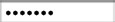

<h3 id="text_area"> 4. Text Area</h3>

- ```<textarea>``` is used to create a multi-line text input.
- attribute ```cols``` and ```rows``` are used to indicate how big the text area should be.
- we can use JavaScript to clear when information has been sent to the server.

```html
<form action="http://www.example.com/comments.php">
	<p>What did you think of this gig?</p>
	<textarea name="comments" cols="20" rows="4">Enter your comments...</textarea>
</form>
```

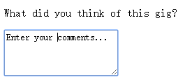

<h3 id="radio_button"> 5. Radio Buttons</h3>

- attribute **type** is set as the value of 'radio' resulting in that user can just pick **only one of a number of options**.
- attribute **value** indicates the value that is sent to the server for the selected option.
- attribute **checked** indicates which option will be selected when the page loads.

```html
<form action="http://www.example.com/profile.php">
	<p>Please select your favorite genre:
	<br />
	<input type="radio" name="genre" value="rock" /> Rock
	<input type="radio" name="genre" value="pop" /> Pop
	<input type="radio" name="genre" value="jazz" checked="checked" /> Jazz
	</p>
</form>
```

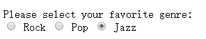

<h3 id="checkbox"> 6. Checkbox</h3>

- attribute **type** is set as the value of 'radio' resulting in that user can pick **one or more than one options**.

```html
<form action="http://www.example.com/profile.php">
	<p>Please select your favorite music service(s):
	<br />
	<input type="checkbox" name="service" value="itunes" checked="checked" /> iTunes
	<input type="checkbox" name="service" value="lastfm" checked="checked"/> Last.fm
	<input type="checkbox" name="service" value="spotify" /> Spotify
	</p>
</form>
```

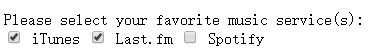

<h3 id="drop_down_list_box"> 7. Drop Down List Box</h3>

- allows users to select one option from a drop down list.
- ```<select>``` is used to create a drop down list box.
- ```<option>``` is used to specify what options can be selected.
- attribute **selected** indicates which option is selected when the page loads.
- attribute **size** indicates how many options are shown at once.

```html
<form action="http://www.example.com/profile.php">
	<p>What device do you listen to music on?</p>
	<select name="devices">
		<option value="ipod">iPod</option>
		<option value="radio">Radio</option>
		<option value="computer">Computer</option>
	</select>
</form>
```

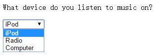

- attribute **multiple** indicates that users can select one or more than one options.

```html
<form action="http://www.example.com/profile.php">
	<p>Do you play any of the following instruments? (You can select more than one option by holding down control on a PC or command key on a Mac while selecting different options.)</p>
	<select name="instruments" size="3" multiple="multiple">
		<option value="guitar" selected="selected">Guitar</option>
		<option value="drums">Drums</option>
		<option value="keyboard" selected="selected">Keyboard</option>
		<option value="bass">Bass</option>
	</select>
</form>
```

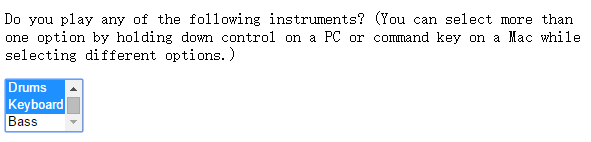

<h3 id="file_input_box"> 8. File Upload</h3>

- attribute **type** is set as the value of 'file' resulting in that user can upload a file by a **browse** button.

```html
<form action="http://www.example.com/upload.php"
method="post">
	<p>Upload your song in MP3 format:</p>
	<input type="file" name="user-song" />
	<br />
	<input type="submit" value="Upload" />
</form>
```

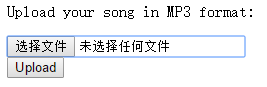

<h3 id="submit_button"> 9. Submit Button</h3>

- attribute **type** is set as the value of 'submit' resulting in sending a form to the server.

```html
<form action="http://www.example.com/subscribe.php">
	<p>Subscribe to our email list:</p>
	<input type="text" name="email" />
	<input type="submit" name="subscribe" value="Subscribe" />
</form>
```

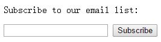

<h3 id="image_button"> 10. Image Button</h3>

- attribute **type** is set as the value of 'image' resulting in that a button can be designed by an image.

```html
<form action="http://www.example.org/subscribe.php">
	<p>Subscribe to our email list:</p>
	<input type="text" name="email" />
	<input type="image" src="./subscribe.png
" width="100" height="20" />
</form>
```


## Different Form Controls

### 1. Button & Hidden Controls

- ```<button>``` allows other elements to appear inside the button.
- attribute **type** is set as the value of 'hidden', so that developers can collect information while users cannot see the control.

```html
<form action="http://www.example.com/add.php">
	<button> Add</button>
	<input type="hidden" name="bookmark" value="lyrics" />
</form>
```

### 2. Labelling Form Controls

- ```<label>``` can be used in two ways
	- Wrap around(迴繞) both the **text description** and the **form input**.

	```html
<label>Age: <input type="text" name="age" /></label>
```

	- attributes ```for``` is used to sperate label from the form control, and indicate which form control the label is for.

	```html
<input id="female" type="radio" name="gender" value="f">
<label for="female">Female</label>
<input id="male" type="radio" name="gender" value="m">
<label for="male">Male</label>
```

- when ```<label>``` is used with a checkbox or radio buttion, users can click on either the **form control** or the **label** to select. 
- best places to place labels on form controls:
	- **ABOVE** OR **THE LEFT**
		- Text inputs
		- Text areas
		- Select boxes
		- File uploads
	- **RIGHT**
		- Individual checkboxes
		- Individual radio butions

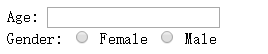

### 3. Grouping Form Elements

- ```<fieldset>``` can be used to **group** related form controls together, and most browsers will show it with a **line** around, whose appearence can be adjsted using **CSS**.

- ```<legend>``` is used to describe the group

```html
<fieldset>
	<legend>Contact details</legend>
	<label>Email:<br />
		<input type="text" name="email" />
	</label>
	<br />
	<label>Mobile:<br />
		<input type="text" name="mobile" />
	</label>
	<br />
	<label>Telephone:<br />
		<input type="text" name="telephone" />
	</label>
</fieldset>
```
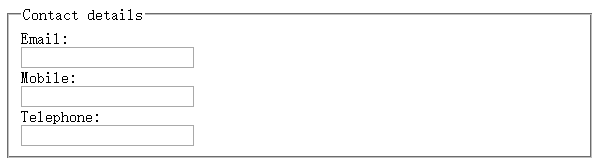

### 4. HTML5 properties

##### 1. Form Validation

- attributes **required** is set as 'required' to restrict that users should fill out this form control in **HTML5**. (**Form Validation(有效性)**)
- generally Form Validation has been performed using JavaScript, but HTML5 has left this work to the browser.
- Form Validation has ensured that the information users enter can be understood by the server.

```html
<form action="http://www.example.com/login/" method="post">
	<label for="username">Username:</label>
	<input type="text" name="username" required="required" />
	<br />
	<label for="password">Password:</label>
	<input type="password" name="password" required="required" />
	<input type="submit" value="Submit" />
</form>
```

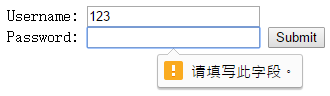

##### 2. Date

- attribute **type** is set as the value of 'date', so that users can select a date with the special form in **HTML5**.

```html
<form action="http://www.example.com/bookings/" method="post">
	<label for="username">Departure date:</label>
	<input type="date" name="depart" />
	<input type="submit" value="Submit" />
</form>
```

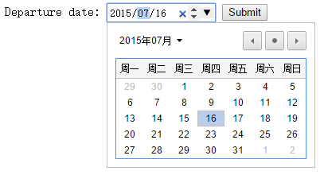

##### 3. Email

- attribute **type** is set as the value of 'email', so that users can input an email address with the special form in **HTML5**.

```html
<form action="http://www.example.org/subscribe.php">
	<p>Please enter your email address:</p>
	<input type="email" name="email" />
	<input type="submit" value="Submit" />
</form>
```

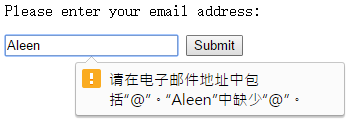

##### 4. URL

- attribute **type** is set as the value of 'url', so that users can input a url address with the special form in **HTML5**.

```html
<form action="http://www.example.org/profile.php">
	<p>Please enter your website address:</p>
	<input type="url" name="website" />
	<input type="submit" value="Submit" />
</form>
```


##### 5. Search

- attribute **type** is set as the value of 'search', so that users can input search content with the special form in **HTML5**.
- attribute **placeholder** is set as default to describe what users should enter.

```html
<form action="http://www.example.org/search.php">
	<p>Search:</p>
	<input type="search" name="search" placeholder="search..."/>
	<input type="submit" value="Search" />
</form>
```

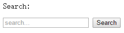

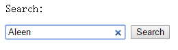

