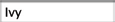
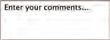
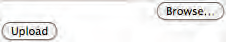

## Forms [Back](./../HTML.md)

- **Forms** has referred to a printed document that contains spaces for you to fill in information.
- Types:
	- Adding Text: 
		- <a href="#text_input">Text input(single-line)</a>: 
		- Password input: 
		- Text area(multi-line): 
	- Making Choices:
		- Radio buttons: 
		- Checkboxes: 
		- Drop-down boxes: 
	- Submitting Forms:
		- Submit buttons: 
		- Image buttons: 
	- Uploading Files:
		- File upload: 

- Process:
	- 1. A user **fills** in a form and then presses a button to **submit** the information to the server.
	- 2. The name of each form control is sent to the server along with the value the user enters or selects.
	- 3. The server processes the infromation using a programming language for back-end development such as **PHP**, **C#**, **VB.net** or **Java**. Sometimes data is also stored in a **database**.
	- 4. The server creates a new page to send back to the browser so that users can get the feedback of submitting successfully.

### 1. Form Structure

- ```<form>``` includes **form controls**.
- attribute ```action``` indentifies where to send the information
- attribute ```method``` indentifies how to send the information(get/post)
	- get: get information form the server
	- poset： send information to the server

```html
<form action="http://www.example.com/subscribe.php"
method="get">
	<p>This is where the form controls will appear.</p>
</form>
```

<h3 id="text_input"> 2. Text Input</h3>

<a href="#" style="left:200px;"></a>
=====
<a href="http://aleen42.github.io/" target="_blank" ></a>
