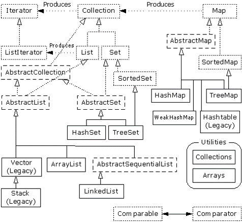

## Collection [Back](./../Java.md)



- 集合都用泛型設計(與C++中的模版相像)
- 集合加入的均為對象(若是值類型, 則需要採用裝箱)
- Interator(迭代器用於實現遍曆)
- Enumeration(用於Vector的遍曆)
- Comparable(用於實現排序)
- 注意: Collection, List, Set, Map等都是**接口**

> Collection
>> Set(不可重複)
>>> Sorted Set
>>>> HashSet/LinkedSet/TreeSet(紅黑樹排序)

>> List(可重複)
>>> ArrayList(類似Vector, 但Vector保證了線程安全性) /LinkedList(雙向)

>> Map(键值对, 鍵唯一)
>>> SortedMap
>>>> HashMap/TreeMap

###ArrayList

```java
ArrayList<Object> list = new ArrayList<Object>();
list.add(Object object);
list.clear();
list.indexOf(Obect object);
list.remove(int index);
list.remove(Object object);
list.get(int index);
list.iterator().next();
list.iterator().hasNext();
```

###HashMap
```Java
java.util.HashMap hashmap = new java.util.HashMap();
hashmap.put(Object key, Object value);
hashmap.get(Object key);
hashmap.isEmpty();
hashmap.containsKey(Object key);
hashmap.size();
```

###Vector
```Java
Vector vector = new Vector();
vector.addElement(Object object);
vector.add(Object object);
vector.elementAt(int index);
vector.get(int index);
vector.removeElement(Object object);
vector.elements().nextElement();		//Enumeration
```

