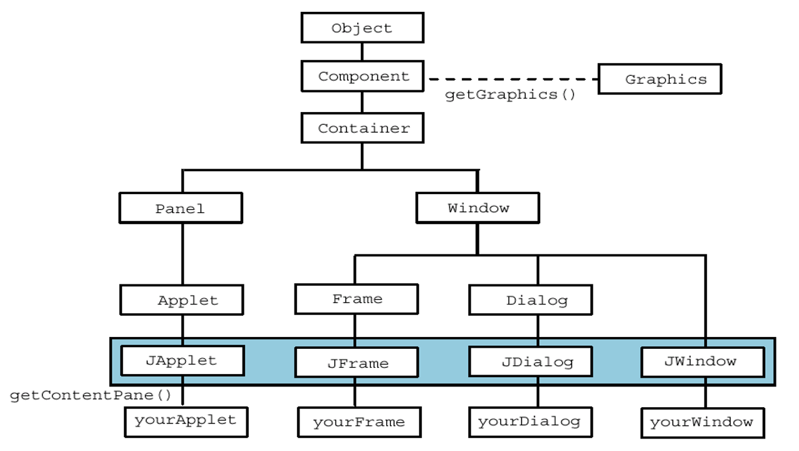

## GUI [Back](./../Java.md)

- **GUI**(Graphics User Interface)
- **AWT**(Abstract Windowing Toolkit), 是java的一個基本類庫, 用於提供GUI設計, 以及鼠標鍵盤事件的監聽
- **Swing**是AWT的一個擴展, 可以編寫採用本地風格的GUI
- **Container**是包括容器類的所有GUI類的根類
- all the components inherited from **Window** cannot add to a container(**Container**).



- **JComponent**是Container的子類

>Container
>>JComponent
>>>JPanel

>>>JList

>>>AbstractButton
>>>>JButton

### Four "top-level" Containers of Swing
4個容器都可以通過`getContentPane()`來獲取對應的Container, 然後添加對應的顯示組件

- ####JFrame
主要用於創建複雜Desktop App

- ####JApplet
主要創建Browser App

- ####JDialog
主要創建彈出的Dialog(消息框)

- ####JWindow
輕量級JFrame, 沒有標題欄和窗口按鈕

### Middle-level Containers

- ####JPanel

- ####JScrollPane

- ####JSplitPane

- ####JTabbedPane

- ####JToolBar

### Event Handler
eg. 以關閉按鈕為例

##### Method 1

- ####確定事件類型以及事件對應的接口

- ####實現接口裏的方法

	```java
class My_frame extends JFrame implements ActionListner{
	//implement
	public void actionPerformed(ActionEvent event){
		System.exit(0);
	}
}
```
- ####註冊監聽對象

	```java
class My_frame extends JFrame implements ActionListner{
	public void actionPerformed(ActionEvent event){//...}
	public My_frame(){
		JButton CloseButton = new JButton();
		CloseButton.addActionListner(this);
	}
}
```

##### Method 2
- ####直接添加(內部類)

	```java
class My_frame extends JFrame{
	public My_frame(){
		JButton CloseButton = new JButton();
		CloseButton.addActionListner(new ActionListner(){
			public void actionPerformed(ActionEvent event){
				System.exit(0);
			}
		});
	}
}
```

### Desktop App

```java
class My_frame extends JFrame
{
	private JPanel contentPane;
	
	public static void main(String[] args)
	{
		EventQueue.invokeLater(new Runnable() {
			public void run() {
				try {
					My_frame frame = new My_frame();
					frame.setVisible(true);
				} catch (Exception e) {
					e.printStackTrace();
				}
			}
		});
	}

	public My_frame(){
		contentPane = JPanel();
		contentPane.add(JComponent component);
		setBounds(100, 100, 450, 300);
		contentPane = new JPanel();
		contentPane.setBorder(new EmptyBorder(5, 5, 5, 5));
		contentPane.setLayout(new BorderLayout(0, 0));
		
		setContentPane(contentPane);
	}
}
```

